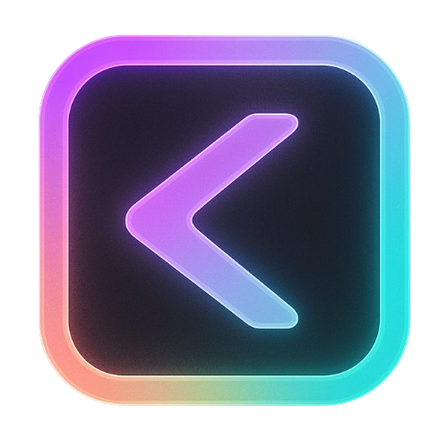
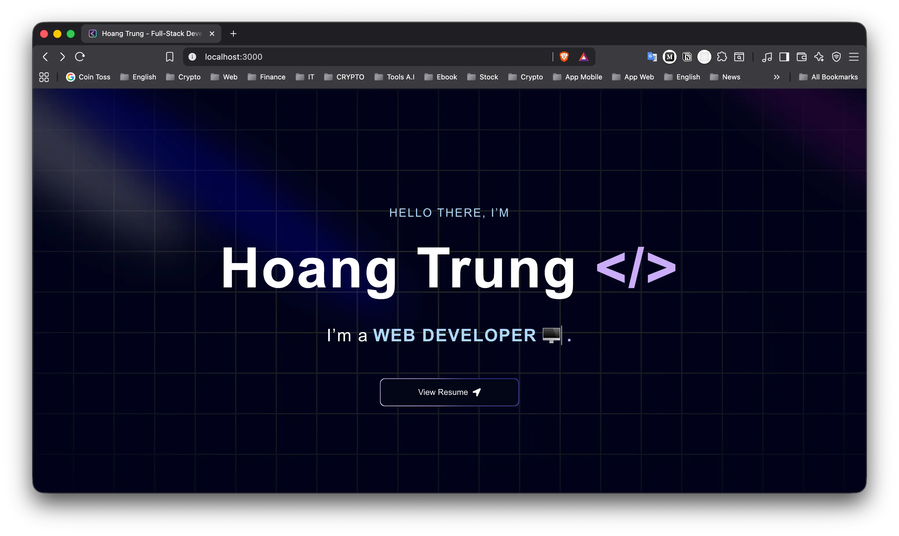
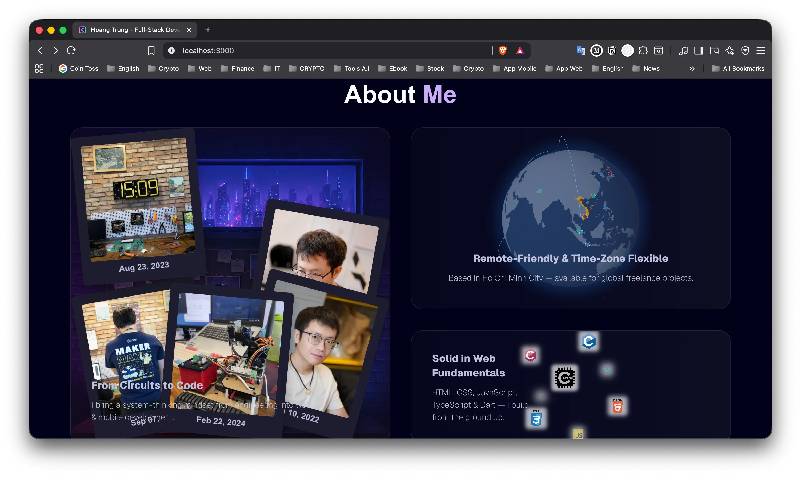
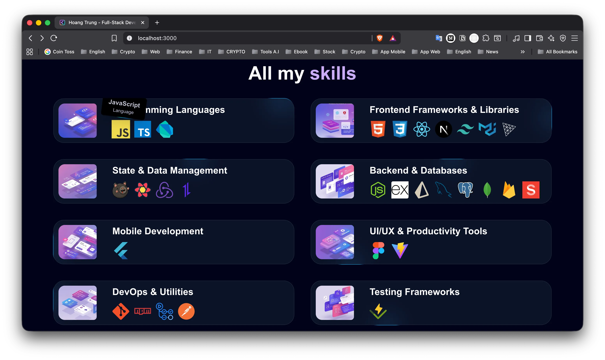
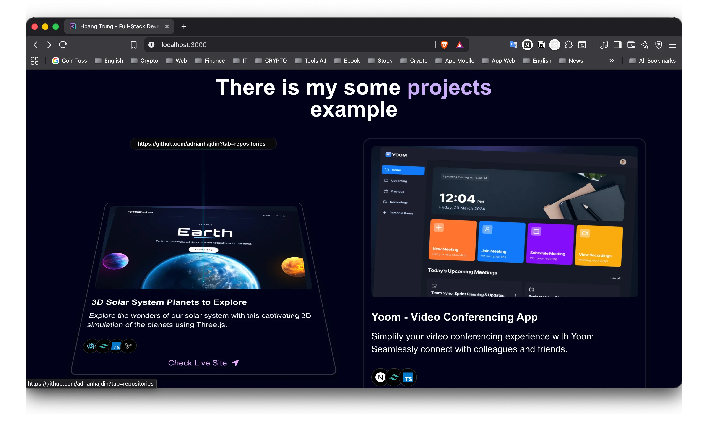
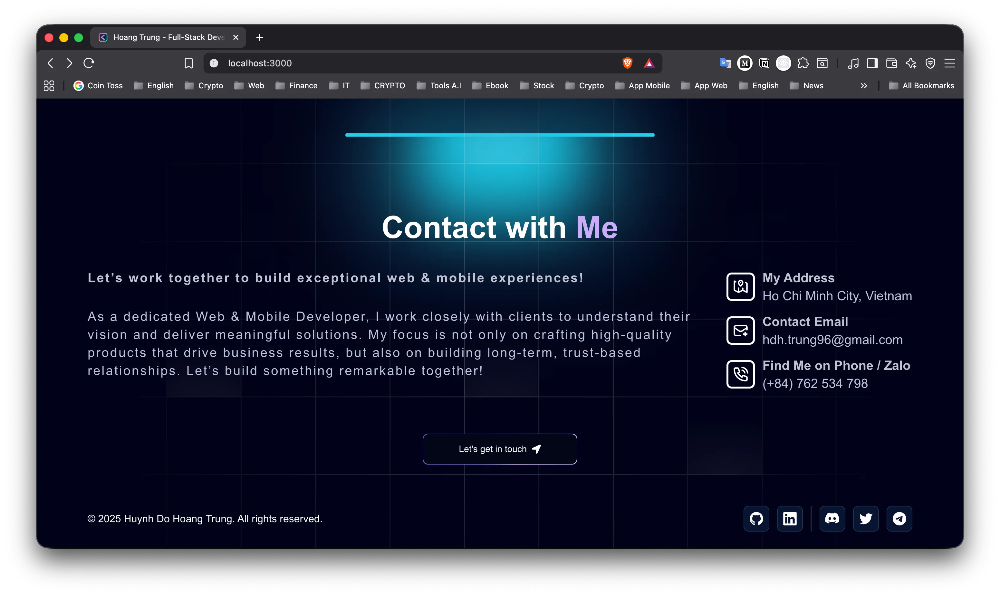
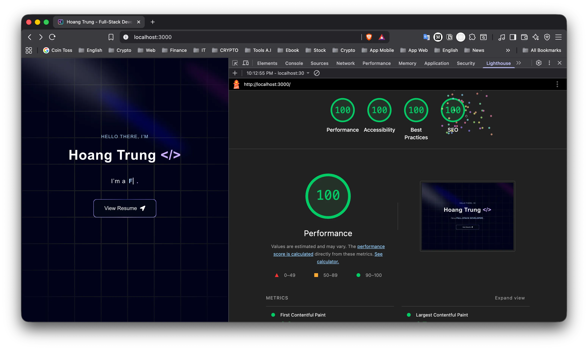
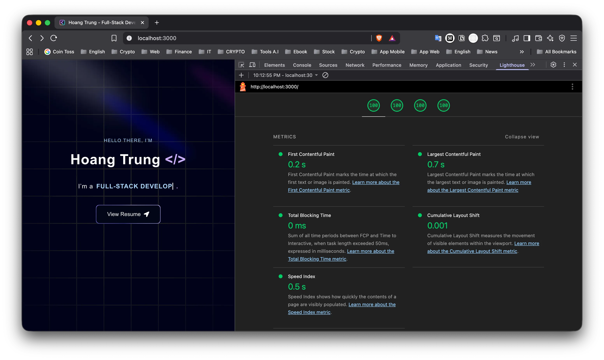
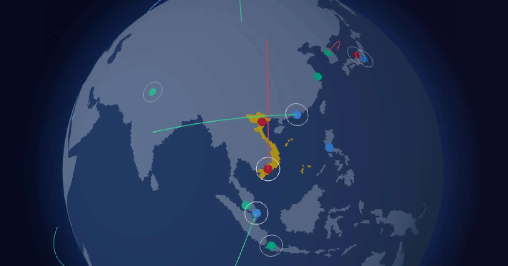
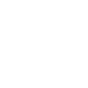

# 👤 Portfolio Web

> Modern single-page portfolio built with Next.js 15, React 19, and Tailwind CSS, featuring animated Aceternity UI components, 3D globe visualization with Three.js, and SSG rendering.
>
> 🙋🏻 _Hi, this is my first personal web project ➡️ a **`Developer Portfolio`**_ 😁

## 🚀 Demo

<p align="center">

| 👉🏻 [**Live Demo**](https://?!) |  |
| :----------------------------: | :----------------------------------------------------------------------------------------: |

</p>

### 🧩 Example Screenshot:

| Section     | Screenshot                                                                            |
| ----------- | ------------------------------------------------------------------------------------- |
| 🦸🏻‍♂️ Hero     |          |
| 💬 About    |        |
| 💪 Skills   |      |
| 🚀 Projects |  |
| 📨 Contact  |    |

## ✨ Features



### ⚡️ Performance

- Static Site Generation (SSG) for fast loading
- Dynamic imports & code splitting
- Optimized images & SVG icons
- Bundle size optimization



### 🎨 UI/UX

- Interactive 3D globe visualization with Three.js
- Beautiful animated components from Aceternity UI
- Smooth scroll animations with Framer Motion
- Fully responsive design



### 🔍 SEO & Accessibility

- SEO-optimized metadata
- Structured data (JSON-LD)
- Semantic HTML
- Mobile-friendly

## 🧰 Tech Stack

- **Framework:** `Next.js 15 (App Router)` 
- **Language:** `React 19`  `TypeScript` 
- **Styling:** `Tailwind CSS v4` 
- **3D Engine:** `Three.js`  `React Three Fiber`
- **Deployment:** `Vercel` 

<p align="center">
  <strong>More Details About The Project 👇🏻 Below</strong>
</p>

> ---
>
> ### 📚 [Docs README](https://github.com/TrungKuro/portfolio-web/tree/main/doc)
>
> ---

## 🖼️ Framework

#### [**NEXT.JS**](https://nextjs.org/)

- Chạy Web ở chế độ `Dev`:

  ```
  npm run dev
  ```

  - `Local` - ví dụ ➡️ http://localhost:3000
    - Chỉ truy cập được trên chính máy bạn.
    - `localhost` hoặc `127.0.0.1` là _"địa chỉ loopback"_ (vòng về máy mình), không đi qua _"mạng LAN"_.
    - Dùng khi bạn code và test trực tiếp trên máy đang chạy **server**.
    - Nếu bạn gửi link này cho người khác hoặc mở trên thiết bị khác (cùng **Wi-Fi**), họ sẽ không truy cập được.
  - `Network` - ví dụ ➡️ http://192.168.2.61:3000
    - Là _"địa chỉ IP"_ trong _"mạng LAN" (nội bộ)_.
    - Máy khác trong cùng mạng **Wi-Fi/LAN** có thể truy cập app của bạn qua link này.
    - Hữu ích khi:
      - Test website trên điện thoại hoặc tablet.
      - Cho người khác xem demo ngay trên mạng nội bộ.

- Chạy Web ở chế độ `Product`:

  ```
  # 0A. [Optional] Delete the entire build .next folder
  rm -rf .next

  # 0B. [Optional] Clear SWC cache as well
  rm -rf .next/cache

  # 1. Build production
  npm run build

  # 2. Start server
  npm run start
  ```

## 🎨 Styling

#### [**TAILWIND CSS**](https://tailwindcss.com/)

- [Install Tailwind CSS with Next.js](https://tailwindcss.com/docs/installation/framework-guides/nextjs)
- [Responsive design](https://tailwindcss.com/docs/responsive-design)
- [font-size](https://tailwindcss.com/docs/font-size)

#### [**ACETERNITY UI**](https://ui.aceternity.com/)

- [Spotlight](https://ui.aceternity.com/components/spotlight)
- [Grid and Dot Backgrounds](https://ui.aceternity.com/components/grid-and-dot-backgrounds)
- [Text Generate Effect](https://ui.aceternity.com/components/text-generate-effect)
- [Floating Navbar](https://ui.aceternity.com/components/floating-navbar)
- [Bento Grid](https://ui.aceternity.com/components/bento-grid)
- [Background Gradient Animation](https://ui.aceternity.com/components/background-gradient-animation)
- [GitHub Globe](https://ui.aceternity.com/components/github-globe)
- [3D Animated Pin](https://ui.aceternity.com/components/3d-pin)
- [Infinite Moving Cards](https://ui.aceternity.com/components/infinite-moving-cards)
- [Moving Border](https://ui.aceternity.com/components/moving-border)
- [Canvas Reveal Effect](https://ui.aceternity.com/components/canvas-reveal-effect)
- [Tailwind CSS buttons](https://ui.aceternity.com/components/tailwindcss-buttons)
- [Lamp Section Header](https://ui.aceternity.com/components/lamp-effect)
- [Animated Tooltip](https://ui.aceternity.com/components/animated-tooltip)
- [Meteor Effect](https://ui.aceternity.com/components/meteors)
- [Lens](https://ui.aceternity.com/components/lens)

#### [**MATERIAL UI**](https://mui.com/)

- [Tooltip](https://mui.com/material-ui/react-tooltip/)

#### [**SHADCN UI**](https://ui.shadcn.com/)

- [Icon Cloud](https://magicui.design/docs/components/icon-cloud)

## 📦 Package Manager

#### [**NPM**](https://www.npmjs.com/)

- 👉🏻 Lệnh <u>cài đặt gói</u>:
  - Viết đầy đủ: `npm install`
  - Viết tắt: `npm i`

- 👉🏻 Lệnh <u>gỡ cài đặt gói</u>:
  - Viết đầy đủ: `npm uninstall`
  - Viết tắt: `npm un`, `npm rm`, `npm r`

- 🚩 Flag - <u>cờ</u>:
  - Chọn _"dependencies"_ cho quá trình `Deploy`:
    - ⚠️ là <u>mặc định</u> ➡️ không cần ghi ra
    - Viết đầy đủ: `--save`
    - Viết tắt: `-S`
  - Chọn _"devDependencies"_ cho quá trình `Dev`:
    - Viết đầy đủ: `--save-dev`
    - Viết tắt: `-D`
  - Chọn _"toàn bộ"_ trong dự án:
    - Viết đầy đủ: `--global`
    - Viết tắt: `-g`

- ✅ Tóm lại:

  ```
  # Mặc định cài vào dependencies (từ npm 5+)
  npm install "tên-package"

  # Cài vào devDependencies
  npm install --save-dev "tên-package"
  # Hoặc viết tắt:
  npm install -D "tên-package"

  # Cài vào dependencies (tường minh)
  npm install --save "tên-package"
  # Hoặc viết tắt:
  npm install -S "tên-package"
  ```

- 📌 Lệnh _"kiểm toán lỗ hổng"_ ➡️ `npm audit`
  - Quét toàn bộ `[dependency]` trong project.
  - Báo cáo <u>lỗ hổng bảo mật</u> _(severity: 🟢 low, 🟡 moderate, 🔴 high, ⚠️ critical)_.

- 📌 Lệnh _"xóa cache lỗi"_ ➡️ `npm cache clean --force`
  - Xoá toàn bộ `cache package` mà `NPM` đã <u>lưu cục bộ</u>.
  - Dùng khi cache bị lỗi, tải gói thất bại, hoặc gặp sự cố mạng.
  - Thêm cờ `--force` vì mặc định `NPM` không cho xoá hết cache.

- 📌 Lệnh _"ép update để vá lỗ hổng"_ ➡️ `npm audit fix --force` (⚠️ nhưng có rủi ro)
  - Cố gắng tự động <u>nâng cấp package</u> để <u>vá lỗ hổng bảo mật</u>.
  - Cờ `--force` buộc update lên phiên bản mới nhất ngay cả khi vượt ngoài range trong `[package.json]`
  - ⚠️ Có thể gây _"breaking changes"_ (hỏng code).

#### Packages:

- [next-themes](https://www.npmjs.com/package/next-themes) → [Adding dark mode to your next app](https://ui.shadcn.com/docs/dark-mode/next)
- [react-icons](https://www.npmjs.com/package/react-icons) → [Popular icons in your React projects](https://react-icons.github.io/react-icons/)
- [react-lottie](https://www.npmjs.com/package/react-lottie) → [Package contains type definitions for react-lottie](https://www.npmjs.com/package/@types/react-lottie)
- [framer-motion](https://www.npmjs.com/package/framer-motion) → [Get started with Motion for React](https://motion.dev/docs/react) → [motion](https://www.npmjs.com/package/motion)
- [react-intersection-observer](https://www.npmjs.com/package/react-intersection-observer) → [Scroll animations](https://motion.dev/docs/react-scroll-animations)
- [typewriter-effect](https://www.npmjs.com/package/typewriter-effect) → [Typewriter Effect](https://css-tricks.com/snippets/css/typewriter-effect/)
- [lottie-react](https://www.npmjs.com/package/lottie-react) → [Lottie for React](https://lottiereact.com/)
- [depcheck](https://www.npmjs.com/package/depcheck) → A `tool` for analyzing the `[dependencies]` in a project.
- [prettier](https://www.npmjs.com/package/prettier) + [prettier-plugin-tailwindcss](https://www.npmjs.com/package/prettier-plugin-tailwindcss/v/0.0.0-insiders.d539a72) → A `Prettier plugin` for `Tailwind CSS v3.0+` that automatically sorts `[classes]`.

## ⚙️ Support Tools

#### Tool Web:

- Cho `CSS`:
  - [CSS Gradient](https://cssgradient.io/)
  - [CSS Loaders](https://css-loaders.com/)
  - [Loaders](https://cssloaders.github.io/)

- Cho `SVG`:
  - [SVG Repo](https://www.svgrepo.com/)
  - [SVGOMG](https://svgomg.net/)
  - [DevIcon](https://devicon.dev/)
    - ➡️ [DevIcon Web](https://devicon-website.vercel.app/)
    - ➡️ [IconGram](https://icongr.am/)
    - ➡️ [DevIcon UI](https://devicon-ui.vercel.app/)
    - ➡️ [SVG Icon](https://svgicons.com/icon-set/svg-logos-svg-icons)

- Cho `GIF`:
  - [Lottie Files](https://lottiefiles.com/)

- Cho `Favicon`:
  - [Favicon.ico & App Icon GeneratorFrom Dan's Tools](https://www.favicon-generator.org/)
  - [Favic-o-matic](https://favicomatic.com/)

- Cho `Font`:
  - [Cool Symbols & Fonts](https://coolsymbol.com/)
  - [Google Fonts](https://fonts.google.com/?query=Nunito+Sans)

- Cho `Edit Image`:
  - [Squoosh](https://squoosh.app/)
  - [11zon](https://www.11zon.com/vi/)
  - [Remove BG](https://www.remove.bg/vi)
  - [Canva](https://www.canva.com/)

- Cho `Optimize Web`:
  - [Bundlephobia](https://bundlephobia.com/)

#### Tool WebPack:

```
Webpack = Module Bundler
        – công cụ giúp bạn compile các module Javascript
```

- [SVGR](https://react-svgr.com/) → [Configure your Next.js project to import SVG as React components](https://react-svgr.com/docs/next/)

#### Tool CLI:

```
CLI – Command Line Interface
    – Giao diện dòng lệnh
```

- [SVGO](https://svgo.dev/) → [svgo](https://github.com/svg/svgo)

#### Tool 3D ➡️ [**THREE.JS**](https://threejs.org/):

- [Canvas](https://r3f.docs.pmnd.rs/api/canvas)
- Hook
  - [useFrame](https://sbcode.net/react-three-fiber/use-frame/)
  - [useThree](https://gracious-keller-98ef35.netlify.app/docs/api/hooks/useThree/)
  - [useProgress](https://drei.docs.pmnd.rs/loaders/progress-use-progress)
- Object3D → Light
  - [AmbientLight](https://threejs.org/docs/?q=ambientLight#api/en/lights/AmbientLight)
  - [DirectionalLight](https://threejs.org/docs/?q=directionalLight#api/en/lights/DirectionalLight)
  - [PointLight](https://threejs.org/docs/?q=pointLight#api/en/lights/PointLight)
- Controls
  - [OrbitControls](https://threejs.org/docs/#examples/en/controls/OrbitControls)

## 🧔🏻 About My `Portfolio`

- Những nguồn **Portfolio** tham khảo:
  - 💎 https://www.youtube.com/watch?v=FTH6Dn3AyIQ
  - ✅ https://www.v1.ashish.top/
  - ✅ https://mohi-portfolio.netlify.app/
  - ✅ https://chanhdai.com/
  - ❌ https://ymelnychenko.com/
  - ❌ https://www.lokeshdev.in/

#### Các `Page` chính

```
📌 Page Loading 💫 (app/loading.tsx)
📌 Page Content ✅ (app/page.tsx)
📌 Page Error   ❌ (app/error.tsx)
```

- 💫 File [loading.js](https://nextjs.org/docs/app/api-reference/file-conventions/loading) ➡️ giúp bạn tạo UI _"đang tải" (`loading`)_ kết hợp với **Component** `<Suspense>` của **React**.
- 📜 File [layout.js](https://nextjs.org/docs/app/api-reference/file-conventions/layout) ➡️ được sử dụng để xác định `layout` trong ứng dụng **Next.js** của bạn.
  - ✅ File [page.js](https://nextjs.org/docs/app/api-reference/file-conventions/page) ➡️ cho phép bạn định nghĩa UI là _"duy nhất" (`unique`)_ cho một _"tuyến đường" (`route`)_.
- ❌ File [error.js](https://nextjs.org/docs/app/api-reference/file-conventions/error) ➡️ cho phép bạn xử lý các _"lỗi runtime không mong muốn"_ và hiển thị UI _"dự phòng" (`fallback`)_.

#### Tổng quát `Web Architecture`

```
Website Architecture:         Single Page Website
                              ➡️ Header
                              ➡️ Sections
                              ➡️ Footer

Web Application Architecture: SPA (Single Page Application)
                              ➡️ 1 route duy nhất [app/page.tsx]

Web Rendering Patterns:       SSG (Static Site Generation)
                              ➡️ (/) page Home
```

- 👉🏻 **Website Architecture** → Cách bố cục và tổ chức UI của website
  - Loại: _"Single Page Website"_
  - Đặc điểm: chỉ có một trang duy nhất chứa đầy đủ các phần
    - _Header_
    - Các _Section_
    - _Footer_

- 👉🏻 **Web Application Architecture** → Cách điều hướng (routing) và cấu trúc app
  - Loại: `SPA` _(Single Page Application)_
  - Đặc điểm: chỉ có 1 route duy nhất → `/` (tương ứng `app/page.tsx`)

- 👉🏻 **Web Rendering Pattern** → Cách Next.js render page đó
  - Loại: `SSG` _(Static Site Generation)_
  - Đặc điểm: page `/` (Home) được build sẵn thành file HTML + JSON khi `next build`

#### Cấu trúc `Header` _(dự tính)_

```
Logo 👉🏻 hover làm thay đổi hiệu ứng

NavBar ... thanh điều hướng danh sách các “Tiêu đề mục” (Section Heading)
|__ 1️⃣✅ Home     : Gây ấn tượng đầu tiên, giới thiệu bạn là ai, CTA rõ ràng
|__ 2️⃣✅ About    : Tăng sự kết nối – nói ngắn gọn bạn là ai, bạn làm gì, định hướng ra sao
|__ 3️⃣✅ Skill    : Chứng minh bạn có công cụ, tech stack đủ mạnh để làm việc
|__ 4️⃣✅ Projects : Trình bày sản phẩm cụ thể để chứng minh năng lực thực chiến
|__ 5️⃣✅ Contact  : Sau khi đã thuyết phục → kêu gọi hành động (liên hệ, hợp tác)
|
|__ ⚠️ Experience
|__ ❌ Education

Button
|__ My Resume / Download CV 👉🏻 nút tải CV file PDF
|__ Toggle Theme            👉🏻 nút đổi Theme Dark/Light
|__ Toggle Language         👉🏻 nút đổi Language VN/EN
```

#### Cấu trúc các `Section` _(dự tính)_

```
1. [Home] ... hiện tất cả Section trên 1 Page với hiệu ứng hiển thị mỗi khi cuộn xuống

2. [About]
🔹 Đoạn 1 – Định vị vai trò & kinh nghiệm chính
🔹 Đoạn 2 – Thành tựu, năng lực hỗ trợ và mindset
|
✅ Ảnh đại diện : Avatar
✅ Tên          :
✅ Chức danh    :
|
1️⃣ Professional Skills (Kỹ năng chuyên môn)
2️⃣ Stack (Công cụ/kỹ thuật sử dụng)

3. [Experience]
👉🏻 Trình bày kỹ năng thực chiến và thành tựu qua từng vị trí
👉🏻 Trình bày toàn bộ quá trình làm việc
|
✅ Vị trí công việc  :
✅ Công ty           :
✅ Thời gian         : MMM YYYY – MMM YYYY
✅ Trách nhiệm chính : (list)

4. [Education]
|
1️⃣ Tiêu đề    : “Degree” (Bằng cấp chính thức)
✅ Trường     : <tên trường> University
✅ Bằng cấp   : <loại bằng>’s Degree, <chuyên ngành>
✅ Thời gian  : YYYY – YYYY
✅ Biểu tượng : 🏛
|
2️⃣ Tiêu đề      : “Certifications” (Chứng chỉ chuyên môn)
✅ Nền tảng dạy :
✅ Tên khóa học :
✅ Hoàn thành   : MMM YYYY
✅ Biểu tượng   :

5. [Projects]
👉🏻 Giới thiệu danh sách các "dự án" mà mình muốn thể hiện
|
✅ Ảnh mô tả      : Cung cấp hình ảnh trực quan minh họa dự án
✅ Liên kết       : Cho phép nhà tuyển dụng hoặc người xem truy cập trực tiếp dự án
|  💎 Link Code Client (FE)
|  💎 Link Code Server (BE)
|  💎 Live Link        (Deloy)
✅ Tên dự án      :
✅ Mô tả          : Trình bày giá trị và chức năng chính của dự án
✅ Tech Stack Tag : Cho biết kỹ năng và công nghệ mình đã dùng

6. [Skill]
|
🧠 Tech Stack (Icons) : Kỹ năng công nghệ
💡 Soft Skills        : Kỹ năng mềm
🧪 Expertise          : Năng lực chuyên môn

7. [Contact]
👉🏻 Contact With Me ...
|
👉🏻 My Address
✅ Vị trí  : <thành phố>, <quốc gia>
✅ Liên hệ : Email ; Số điện thoại
```

#### Cấu trúc `Footer` _(dự tính)_

```
© 20xx - All right reserved by <you>

✅ Mạng xã hội  : Social
📌 Core IT Socials                           👉🏻 GitHub ; LinkedIn ; Stack Overflow ; Dev.to ; Daily.dev
📌 Phát triển thương hiệu cá nhân / sản phẩm 👉🏻 Product Hunt ; Twitter (X) ; Telegram ; Hashnode ; Discord
```

#### Cấu trúc `Directory` _(dự tính)_

👉🏻 Gợi ý cho thư mục `components`:

```
components/
├── common/                # Component nhỏ tái sử dụng nhiều nơi (Button, SectionWrapper...)
├── layout/                # Wrapper layout (Navbar, Footer...)
├── sections/              # Component từng section: Hero, About, Projects...
└── ui/                    # Thành phần UI như Card, Tabs, Tooltip (nếu có)
```

- 1️⃣ `components/common/` – Thành phần nhỏ, tái sử dụng nhiều nơi
  - Chứa các component cơ bản và <u>không phụ thuộc</u> vào **layout** hay **page** cụ thể.
  - Tính chất:
    - Nhỏ, gọn
    - Tái sử dụng ở nhiều chỗ khác nhau
    - Không chứa logic đặc thù của một trang
  - Ví dụ:
    - Button.tsx → Nút bấm chung (Primary, Secondary…)
    - SectionWrapper.tsx → Bao bọc section kèm padding/margin chuẩn
    - Heading.tsx → Tiêu đề chuẩn của toàn site
    - Container.tsx → Component wrapper giữ độ rộng max-width
  ```
  📌 Mục tiêu: Khi đổi UI hoặc style ở đây, toàn bộ site cập nhật theo.
  ```
- 2️⃣ `components/layout/` – Các phần khung cố định
  - Chứa <u>layout wrapper</u> cho toàn **page** hoặc từng nhóm **pages**.
  - Thường lặp lại trên nhiều trang.
  - Ví dụ:
    - Navbar.tsx → Thanh điều hướng
    - Footer.tsx → Chân trang
    - Sidebar.tsx → Thanh bên
    - MainLayout.tsx → Khung layout chung, chứa header + footer
  - Thường được import ở app/layout.tsx (Next.js 13+) hoặc bọc quanh page.
  ```
  📌 Mục tiêu: Giữ bố cục thống nhất trên tất cả các trang.
  ```
- 3️⃣ components/sections/ – Thành phần đại diện từng phần nội dung
  - Chứa component </u>đặc thù</u> cho từng **section** trên **page**.
  - Thường là một khối nội dung lớn (Hero, About, Contact, v.v).
  - Ví dụ:
    - Hero.tsx → Phần mở đầu trang
    - About.tsx → Giới thiệu
    - Projects.tsx → Danh sách dự án
    - Testimonials.tsx → Feedback khách hàng
  - Thường không tái sử dụng nguyên khối ở trang khác, vì đặc thù nội dung.
  ```
  📌 Mục tiêu: Dễ quản lý khi chỉnh sửa hoặc sắp xếp lại các section của trang.
  ```
- 4️⃣ components/ui/ – Thành phần UI tương tác/đặc biệt
  - Chứa UI component <u>phức tạp</u> hơn common, thường đi kèm **animation** hoặc **logic** riêng.
  - Có thể lấy từ thư viện UI hoặc custom lại.
  - Ví dụ:
    - Card.tsx → Thẻ hiển thị thông tin
    - Tabs.tsx → Thanh tab chuyển nội dung
    - Tooltip.tsx → Gợi ý khi hover
    - Modal.tsx → Hộp thoại bật lên
    - Dropdown.tsx → Menu xổ xuống
  - Tính chất:
    - Có thể tái sử dụng ở nhiều chỗ
    - Phức tạp hơn so với component common
    - Thường được dùng trong sections hoặc layout
  ```
  📌 Mục tiêu: Gom nhóm các UI phức tạp để dễ bảo trì và tái sử dụng.
  ```

👉🏻 Gợi ý cho thư mục `data`:

```
data/                      # Dữ liệu tĩnh JSON
├── header.json
├── home.json
├── about.json
├── skills.json
├── projects.json
├── contact.json
└── footer.json
```

👉🏻 Gợi ý cho thư mục `lib`:

```
lib/
├── content.ts             # Load JSON từ /data hoặc CMS
└── utils.json
```

- Chức năng của `content.ts`
  - 🎯 Mục đích:
    - `content.ts` là nơi tập trung logic để load nội dung hiển thị trên Portfolio, lấy từ:
      - File tĩnh JSON (ví dụ từ thư mục data/)
      - Hoặc từ CMS (nếu sau này bạn tích hợp)
    - Nó giúp:
      - Tách biệt logic xử lý dữ liệu khỏi component UI
      - Dễ bảo trì, mở rộng khi đổi nguồn dữ liệu (chỉ sửa 1 chỗ)
  - ✅ Lợi ích:
    - Dễ mock data khi chưa có CMS
      - Hiện tại được xem là file tĩnh
    - Dễ thay đổi từ "local file" sang "API CMS" chỉ tại `lib/content.ts`
      - Nếu định sau này xài CMS (như Strapi, Sanity, Notion…)
      - Chỉ cần sửa `content.ts` để fetch dữ liệu từ CMS

👉🏻 Gợi ý cho thư mục `public`:

```
public/
├── assets/
│   ├── fonts/             → Nếu dùng custom fonts
│   ├── icons/             → SVG, PNG icons dùng trong UI (menu, social, arrow...)
│   ├── logos/             → Logo cá nhân, logo đối tác, stack logo
│   └── lottie/            → File JSON Lottie animation
│
└── images/
    ├── illustrations/     → Hình minh họa (vẽ tay, 3D, landing)
    ├── misc/              → Hình khác (background, texture, decor...)
    ├── profile/           → Ảnh chân dung, ảnh cá nhân
    └── projects/          → Ảnh preview từng project (thumbnail, screen...)
```

👉🏻 Gợi ý cho thư mục `types`:

```
types/
└── index.d.ts             # Interface cho các section
```
