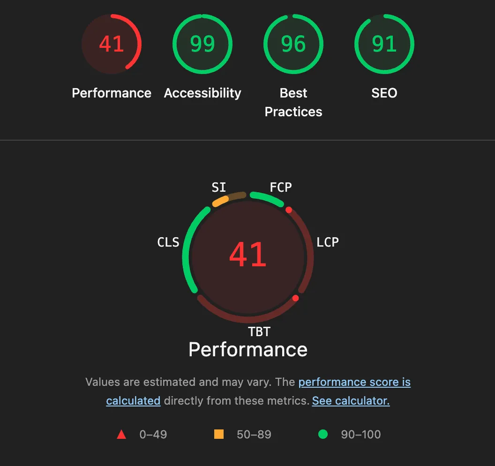
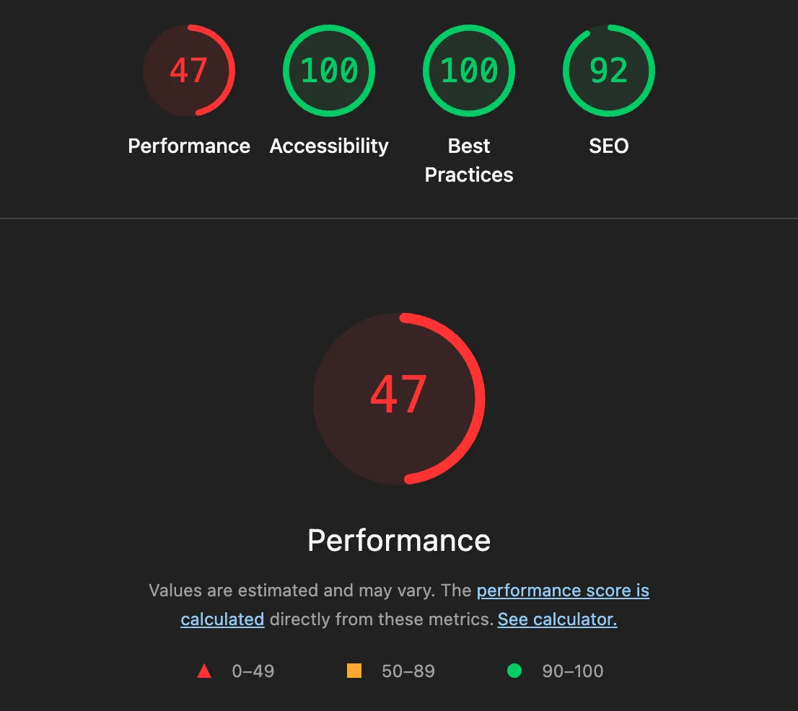
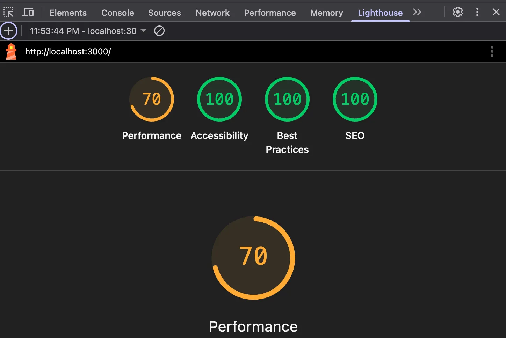
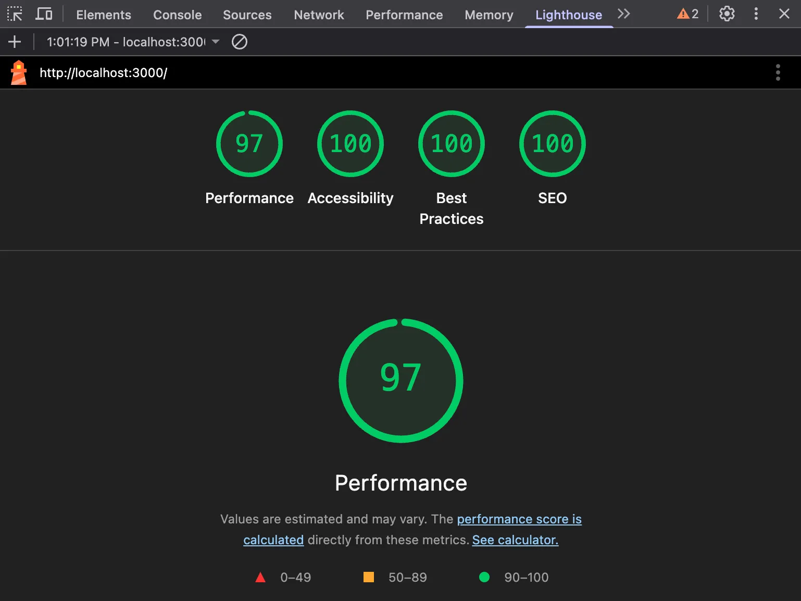
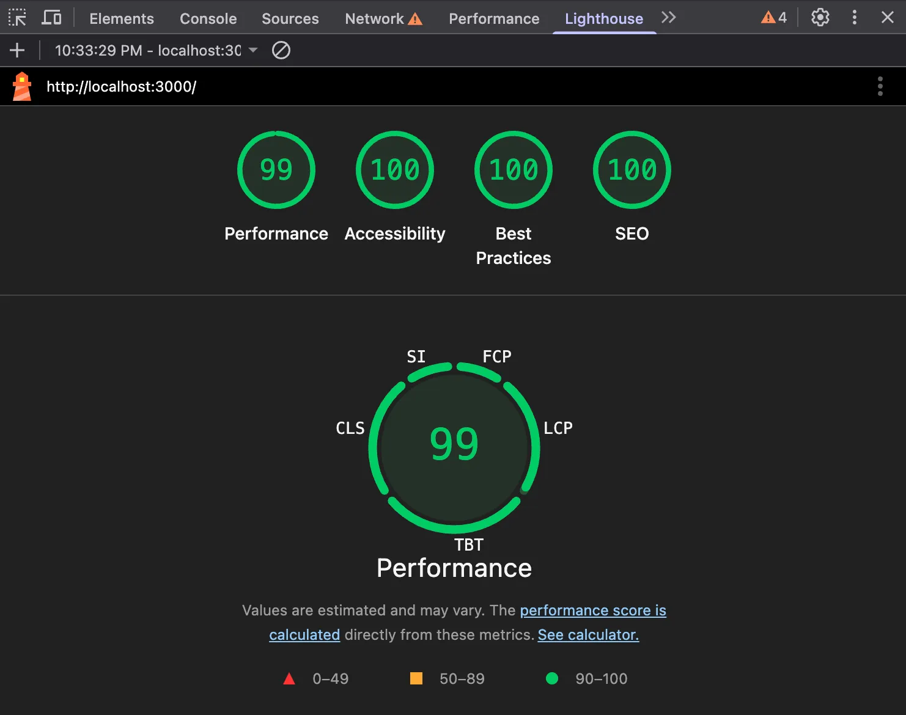
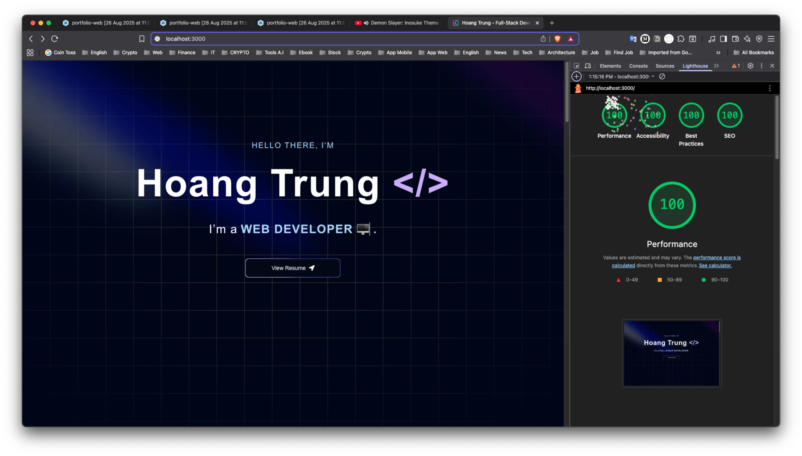
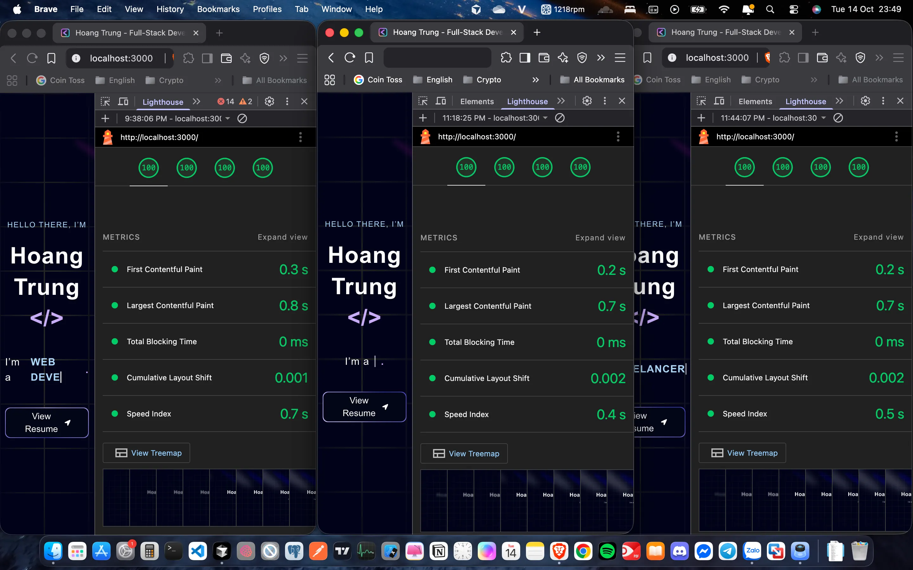
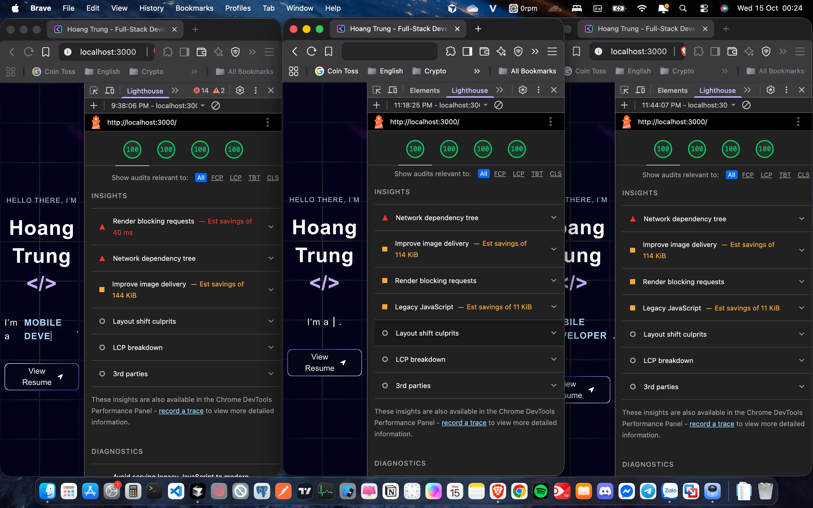
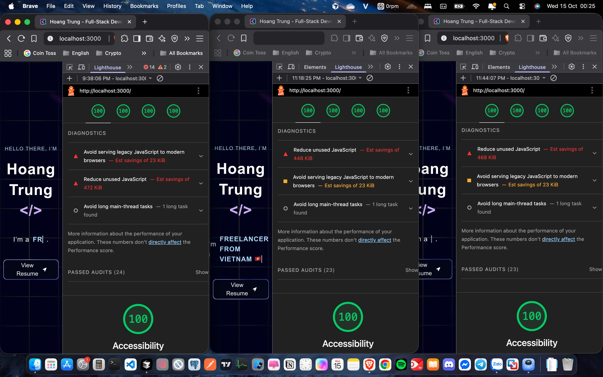
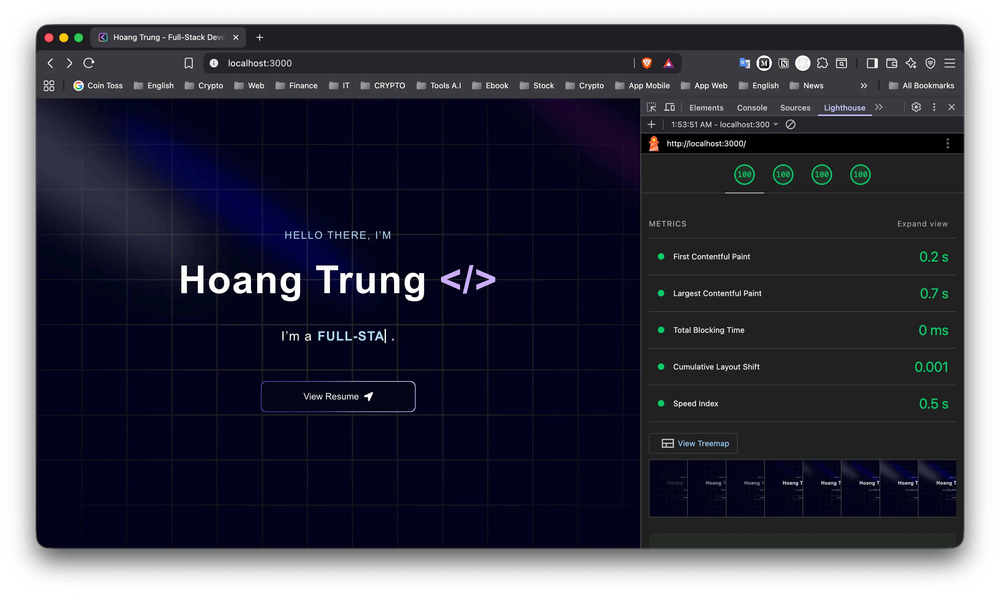

# Dev Tools

👉🏻 Sử dụng công cụ như `Lighthouse` hoặc `WebPageTest` để kiểm tra hiệu suất trang và trải nghiệm người dùng.

- 📌 `Audits` là gì?
  - Nghĩa gốc là kiểm tra, đánh giá, rà soát
  - Thường chỉ quá trình phân tích website

  ```
  Audit = một bản “kiểm toán” nhưng áp dụng cho mã nguồn, hiệu suất, bảo mật, SEO, accessibility…

  Kết quả audit thường là báo cáo kèm đề xuất cải thiện.
  ```

- 📌 `Metrics` là gì?
  - Nghĩa là các chỉ số đo lường — trong lập trình và đặc biệt là web performance
  - Nó là những con số định lượng dùng để đánh giá tình trạng hoặc hiệu suất của một hệ thống

  ```
  Metric = đơn vị đo lường kết quả, giúp bạn biết "tốt" hay "xấu" dựa trên dữ liệu thực tế, thay vì cảm tính.

  Trong web/app, metrics thường được thu thập tự động (tracking, logging, analytics).
  ```

- 📌 `Waterfall` là gì?
  - Biểu đồ thác nước -> biểu đồ thời gian load
  - Trong bối cảnh _"web performance"_ là một <u>biểu đồ thời gian tải tài nguyên</u> cho thấy:
    - Mỗi request (HTML, CSS, JS, ảnh, font, video, API call…) bắt đầu và kết thúc khi nào.
    - Trình tự tải các tài nguyên (cái nào tải song song, cái nào chờ).
    - Mất bao lâu ở từng giai đoạn:
      - DNS Lookup
      - TCP/TLS handshake
      - Request/Response (TTFB – Time To First Byte)
      - Download
      - Blocking / Queuing
      - Rendering

  ```
  Tài nguyên              0ms   200ms   400ms   600ms   800ms  ...
  index.html              ███████████████
  style.css                   █████████
  main.js                          ██████████████████████
  image.jpg                                 ███████████████
  font.woff2                                          ████
  ```

  - Mỗi dòng là 1 request và chiều dài thanh màu thể hiện thời gian tải.
    - Thanh dài → tài nguyên đó tải lâu → có thể cần tối ưu.
    - Thanh bị chồng hoặc xếp nối tiếp → cho thấy tài nguyên này phụ thuộc vào cái khác

- 🎯 Lợi ích khi xem Waterfall:
  - Xác định _"nút cổ chai"_ `(bottleneck)` trong quá trình tải.
  - Phát hiện tài nguyên tải quá chậm hoặc tải sớm không cần thiết.
  - Biết được thứ tự ưu tiên của trình duyệt khi tải file.
  - Phân tích tại sao `LCP`, `TTI`, `TBT` lại cao.

## Google Lighthouse

👉🏻 [What Is Google Lighthouse and How to Use It?](https://www.youtube.com/watch?v=VyaHwvPWuZU)

- [Extension Lighthouse](https://chromewebstore.google.com/detail/lighthouse/blipmdconlkpinefehnmjammfjpmpbjk)
- Ví dụ: chạy báo cáo trên trang web chạy cục bộ tại URL _"http://localhost:3000/"_ bằng extension `Lighthouse` trên trình duyệt `Brave` của hệ điều hành `MacOS`.
  - Với kết quả của bản ghi `JSON` _"20250814T021541"_
  - Tức bản báo cáo của ngày **14-08-2025** vào lúc **2am15:41**
    

👉🏻 Tổng quát các danh mục `Audits`:

- `HIỆU SUẤT (Performance)`: **(41 điểm ❌)**
  - 📌 Đo hiệu suất tải trang
    - Phản ánh: Trang web tải nhanh hay chậm, nội dung hiển thị mượt hay bị trễ.
    - Dựa trên: Các chỉ số như `FCP` **(10 điểm ✅)**, `LCP` **(1 điểm ❌)**, `TBT` **(0 điểm ❌)**, `CLS` **(25 điểm ✅)** `SI` **(5 điểm ⚠️)**, …
    - Mục tiêu: Cải thiện trải nghiệm người dùng về tốc độ và độ mượt.
    - Ảnh hưởng: Trực tiếp đến tỷ lệ thoát, mức độ hài lòng và `SEO`.
- `KHẢ NĂNG TIẾP CẬN (Accessibility)`: **(99 điểm ✅)**
  - 📌 Kiểm tra truy cập cho người khuyết tật
    - Phản ánh: Người dùng, kể cả người khuyết tật (thị giác, thính giác…), có thể truy cập và sử dụng trang hay không.
    - Dựa trên: Các tiêu chuẩn như `WCAG (Web Content Accessibility Guidelines)`.
    - Ví dụ kiểm tra:
      - Có text thay thế (alt) cho ảnh
      - Tương phản màu sắc đủ cao
      - Thứ tự tab hợp lý
      - Hỗ trợ screen reader
    - Mục tiêu: Trang dễ sử dụng cho mọi người, kể cả trên thiết bị trợ năng.
- `THỰC HÀNH TỐT NHẤT (Best Practices)`: **(96 điểm ✅)**
  - 📌 Kiểm tra thân thiện di động
    - Phản ánh: Trang tuân thủ các quy tắc an toàn, kỹ thuật tối ưu và coding hiện đại hay không.
    - Dựa trên:
      - Sử dụng HTTPS
      - Không dùng API hoặc JS lỗi thời
      - Không load tài nguyên không an toàn
      - Kích thước ảnh, font hợp lý
    - Mục tiêu: Đảm bảo trang hoạt động ổn định, an toàn, hiệu quả.
- `TỐI ƯU CÔNG CỤ TÌM KIẾM (SEO)`: **(91 điểm ✅)**
  - 📌 Phân tích SEO cơ bản
    - Phản ánh: Trang có thân thiện với công cụ tìm kiếm (Google, Bing…) hay không.
    - Dựa trên:
      - Cấu trúc HTML hợp lệ
      - Thẻ `<title>` và `<meta description>` đầy đủ
      - Heading cấu trúc hợp lý
      - Mobile-friendly
    - Mục tiêu: Giúp trang dễ được tìm thấy và xếp hạng cao trên kết quả tìm kiếm.

💡 Nói gọn:

```
1️⃣ [ Performance    ] → Nhanh và mượt.
2️⃣ [ Accessibility  ] → Ai cũng dùng được.
3️⃣ [ Best Practices ] → An toàn và đúng chuẩn.
4️⃣ [ SEO            ] → Dễ tìm thấy trên Google.
```

👉🏻 Sử dụng AI đế lấy kết quả phân tích từ file _"localhost_3000-20250814T021541.json"_:

- ⏱️ `Timing`: Tổng thời gian thực hiện báo cáo là **8465 ms**.
- 💯 `Score`: Từ 0-1 (1 là tốt nhất; dưới 0.9 thường cần cải thiện).
- Scores tổng quát:
  - Performance: **0.54** (thấp, cần cải thiện lớn về tốc độ và hiệu suất).
  - Accessibility: **0.92** (tốt, nhưng vẫn có một số vấn đề nhỏ).
  - Best Practices: **0.85** (tốt, nhưng có vấn đề về cache và JavaScript).
  - SEO: **0.98** (rất tốt, gần như hoàn hảo).

- `Metrics` (chỉ số quan trọng)
  - `FCP (First Contentful Paint)` : **1.035s** ✅ Tốt
    - 📌 Thời gian từ lúc tải trang đến khi nội dung đầu tiên (text, ảnh, SVG…) xuất hiện trên màn hình
    - 🏆 Mục tiêu tốt (**≤ 1.8 giây**)
    - 💎 Phản ánh cảm giác trang đã bắt đầu hiển thị gì đó
  - `LCP (Largest Contentful Paint)` : **4.085s** ⚠️ Cần cải thiện
    - 📌 Thời gian từ lúc tải trang đến khi phần tử nội dung lớn nhất trong viewport render xong (thường là ảnh hero hoặc khối text lớn)
    - 🏆 Mục tiêu tốt (**≤ 2.5 giây**)
    - 💎 Phản ánh cảm giác nội dung chính đã xuất hiện
  - `SI (Speed Index)`: **2.199s** ✅ Khá ổn
    - 📌 Đo thời gian nội dung nhìn thấy được của trang xuất hiện nhanh như thế nào. Giá trị càng thấp nghĩa là người dùng thấy trang hiển thị gần đầy đủ càng sớm
    - 🏆 Mục tiêu tốt (**≤ 3.4 giây**)
    - 💎 Phản ánh trải nghiệm thị giác (nội dung hiển thị nhanh hay chậm)

  ```
  FCP / LCP / SI → liên quan đến "thị giác" (thấy gì và khi nào)
    ├── FCP: đo thời điểm đầu tiên bạn thấy được một phần nội dung.
    ├── LCP: đo thời điểm nội dung lớn nhất hiển thị xong.
    └── SI: đo tốc độ tổng thể mà toàn bộ vùng nhìn thấy (viewport) được lấp đầy nội dung theo thời gian.
  ```

  - `TTI (Time to Interactive)` : _10.227s_ ❌ Rất chậm → JS nặng hoặc block
    - 📌 Thời gian từ lúc tải trang đến khi trang hoàn toàn sẵn sàng tương tác (không còn tác vụ JS dài gây block)
    - 🏆 Mục tiêu tốt (**≤ 3.8 giây**)
    - 💎 Phản ánh cảm giác trang đã sẵn sàng để thao tác mà không bị delay
  - `FID (First Input Delay)` : ?
    - 📌 Độ trễ giữa tương tác đầu tiên của người dùng (click, tap, keypress) và khi browser thực sự xử lý sự kiện đó
    - 🏆 Mục tiêu tốt (**≤ 100 mili giây**)
    - 💎 Phản ánh cảm giác trang phản hồi nhanh khi bấm lần đầu
  - `TBT (Total Blocking Time)` : **7.777s** ❌ Quá cao, ảnh hưởng tương tác
    - 📌 Tổng thời gian mà _"main thread"_ bị chặn bởi các tác vụ JavaScript dài (mỗi tác vụ **>50ms**), làm người dùng không thể tương tác
    - 🏆 Mục tiêu tốt (**≤ 200 mili giây**)
    - 💎 Phản ánh trải nghiệm tương tác (bấm, cuộn, nhập liệu có bị delay hay không)

  ```
  TTI / FID / TBT → liên quan đến "tương tác" (có phản hồi nhanh hay không)
  ├── TTI: đo thời điểm trang đã sẵn sàng để người dùng thao tác mà không bị delay.
  ├── FID: đo độ trễ giữa tương tác đầu tiên của người dùng (click, tap, nhập) và khi trình duyệt bắt đầu phản hồi.
  └── TBT: đo tổng thời gian main thread bị chặn bởi tác vụ dài (>50ms), khiến trang không phản hồi kịp với thao tác người dùng.
  ```

  - `CLS (Cumulative Layout Shift)` : 0.00086 ✅ Rất tốt
    - 📌 Đo mức độ dịch chuyển layout không mong muốn trong quá trình tải trang (ảnh chưa có kích thước, font thay đổi…)
    - 🏆 Mục tiêu tốt (**≤ 0.1**)
    - 💎 Phản ánh cảm giác trang có ổn định hay bị xô lệch khi đang xem

  ```
  CLS → liên quan đến sự "ổn định" (layout có bị nhảy hay không)
  └── CLS: đo mức độ dịch chuyển bố cục không mong muốn trong quá trình tải trang (ví dụ: ảnh, quảng cáo, hoặc nội dung mới xuất hiện làm các phần tử khác bị đẩy xuống/xô lệch).
  ```

- 💡 Mẹo tối ưu nhanh theo nhóm:

  ```
  ├── FCP / LCP / SI  → tối ưu ảnh, giảm render-blocking CSS/JS, preload font/ảnh chính
  ├── TTI / TBT / FID → giảm JS, lazy load script, chia nhỏ bundle, tối ưu logic event handler
  └── CLS             → đặt kích thước cố định cho ảnh/video, tránh chèn nội dung bất ngờ
  ```

- ⛑️ Chuẩn đoán (`Diagnostics`):
  - Số request: 27 (ổn).
  - Tổng dung lượng tải: ~ 11.16 MB 🚨 Rất lớn → cần tối ưu ảnh/video.
  - Font: 2 fonts.
  - Script: 6 scripts.
  - CSS: 1 file.
  - Nhiều tác vụ JS dài: 4 tác vụ >500ms → gây lag.

- 🔑 <u>Giải pháp tối ưu</u>:
  - 🔹 Ưu tiên cao 1️⃣:
    - Giảm `LCP` từ 4.0s xuống < 2.5s
      - Dùng `priority` cho `<Image>` hero.
      - Dùng `WebP/AVIF` cho ảnh lớn.
      - Tối ưu kích thước ảnh khớp `viewport`.
    - Giảm `TTI` & `TBT`
      - Chia nhỏ `bundle JS`, `lazy load component` không cần ngay.
      - Loại bỏ JS thừa (đặc biệt thư viện nặng).
      - Sử dụng `React.lazy()` và `dynamic import` trong Next.js.
    - Giảm dung lượng trang (~11MB)
      - Nén ảnh (sử dụng `next/image` hoặc `sharp`).
      - Tránh ảnh/video full-HD nếu không cần.
      - Dùng `video streaming` nếu cần hiển thị animation dài.
  - 🔹 Ưu tiên trung bình 2️⃣:
    - `Preconnect` đến `domain img/font/script` ngoài.
    - `HTTP/2` nếu server chưa bật.
    - `Lazy-load` cho ảnh ngoài `viewport` `(loading="lazy")`.
  - 🔹 Ưu tiên thấp 3️⃣:
    - `Minify CSS/JS` (Next.js build production tự làm).
    - Remove `legacy polyfill` nếu chỉ nhắm tới browser hiện đại.

## File Môi Trường [ .env* ]

👉🏻 **Next.js** sử dụng thư viện `dotenv` để tải các biến môi trường từ các file `.env*`

- Các file môi trường được ưu tiên theo thứ tự sau (từ cao đến thấp):
  - 1️⃣ `.env.local`:
    - File này được sử dụng cho <u>môi trường cục bộ</u> (local development)
    - Có <u>ưu tiên cao nhất</u> trong mọi trường hợp
  - 2️⃣ `.env.development`:
    - Được sử dụng khi chạy `next dev` (hoặc `npm run dev`), nhưng chỉ nếu không có `.env.local`
    - Nếu bạn có `.env.local`, các biến trong file này sẽ <u>ghi đè</u> các biến cùng tên trong `.env.development` hoặc `.env`
  - 2️⃣ `.env.production`:
    - Được sử dụng khi chạy `next build` hoặc `next start` (hoặc `npm run build` và `npm run start`), nhưng chỉ nếu không có `.env.local`
    - Nếu bạn có `.env.local`, các biến trong file này sẽ <u>ghi đè</u> các biến cùng tên trong `.env.production` hoặc `.env`
  - 3️⃣ `.env`:
    - File <u>mặc định</u>, được tải trong mọi trường hợp (`dev`, `build`, `start`)
    - Nhưng có <u>ưu tiên thấp nhất</u> và sẽ <u>bị ghi đè</u> bởi các file khác nếu có cùng `[key]`.

  ```
  [ npm run dev   ] .env.local ➡️ .env.development ➡️ .env

  [ npm run build ] .env.local ➡️ .env.production  ➡️ .env
  ```

👉🏻 Môi trường được xác định bởi `NODE_ENV`:

- `npm run dev` đặt `NODE_ENV=development`.
- `npm run build` và `npm run start` đặt `NODE_ENV=production`.

👉🏻 **Client Variables** vs **Server Variables**:

- Trong **Next.js**, các <u>biến môi trường</u> bắt đầu bằng `NEXT_PUBLIC_` được _"expose"_ cho **client-side (browser)** còn các biến khác chỉ dùng ở **server-side**
- ⚠️ Đảm bảo bạn đặt các <u>biến nhạy cảm</u> (như API keys) không có _"prefix"_ `NEXT_PUBLIC_`

## Các kỹ thuật cải thiện "Performance"

👉🏻 **Lighthouse `Treemap` View**:

- Công cụ giúp bạn thấy "kích thước" và "thành phần" `Bundle JS` khi build Next.js.
  - **Tổng dung lượng**: `http://localhost:3000/ ? MiB` → là tổng dung lượng JS đang tải cho trang này (thường nên giữ dưới `1 MB` nếu có thể).
  - **Treemap**: mỗi ô là một `Bundle JS` hoặc `Chunk JS` → diện tích ô = dung lượng file tương ứng.
  - **Name + Transfer bytes**: liệt kê chi tiết từng file bundle gồm "đường dẫn và kích thước".
- `Treemap` này giúp bạn thấy chỗ nào cần `code splitting`, `dynamic import`, `SSR/SSG` để <u>giảm JS cần load ban đầu</u>.

### Cải thiện `FCP`

👉🏻 **Reduce unused JavaScript:**

- [Remove unused JavaScript](https://developer.chrome.com/docs/lighthouse/performance/unused-javascript/?utm_source=lighthouse&utm_medium=devtools)
  1. Phát hiện JavaScript không sử dụng:
     - Sử dụng `Tab Coverage` sẽ cho bạn biết trang web thực sự sử dụng `CSS/JS` nào.
     - Cách mở `Tab Coverage`:
       - Nhấn tổ hợp `Command+Shift+P (Mac)` hoặc `Control+Shift+P (Windows, Linux, ChromeOS)` trong **DevTools**.
       - Một vùng nhập lệnh **Command Menu** sẽ hiện lên ➡️ nhập _"coverage"_.

### Cải thiện `LCP`

💡 Một số tip:

1. `Dynamic Import` cho **Component_Heavy (ssr: false)** để không block **LCP**.
2. `Code Splitting` để giảm những đoạn **script (.js)** có dung lượng **MB** lớn.
3. Kiểm tra lại `Dependency` xem có **Import** nặng nào không cần thiết.

1️⃣🔎 `Lazy Loading` là gì?

- ⚙️ [How to lazy load Client Components and libraries](https://nextjs.org/docs/app/guides/lazy-loading)
  - 👉🏻 **Tải lười biếng**,là kỹ thuật <u>trì hoãn việc tải</u> code hoặc tài nguyên cho đến khi thật sự cần. Trong React/Next.js:
    - `Dynamic Import` → load component khi cần.
      - ✅ Next.js sẽ <u>tách component ra thành bundle riêng</u> (code splitting) ➡️ **Bundle** đó không tải ngay khi load trang ➡️ **Bundle** đó chỉ được _"tải" `(fetch)`_ từ server khi component (lần đầu) <u>cần được render</u>.
      - ❌ Nhưng nếu bạn không kết hợp <u>điều kiện render</u> (như `Intersection Observer`) ➡️ thì **Bundle** đó vẫn được tải ngay khi React đi qua JSX (component luôn có trong JSX), nghĩa là dù nó ở cuối trang, vẫn load ngay từ đầu.
      - 💎 Nếu kết hợp với `Intersection Observer` ➡️ **Bundle** chỉ load + render khi user scroll tới (viewport tiến tới component đó).
    - `React.lazy` → lazy load component con.
    - `Intersection Observer` → lazy load hình ảnh hoặc component khi scroll đến viewport.

  - ⚠️ **Lazy loading** chỉ áp dụng cho `Client Components`:
    - Nếu một component là `Client Component ("use client";)` thì nó <u>có JS bundle riêng</u> cần gửi xuống browser.
    - _"Lazy loading"_ trong tài liệu Next.js nghĩa là:
      - ✅ Chỉ tải <u>JS bundle</u> của `Client Component` khi cần. Tức component phải là `Client Component` nếu bạn muốn nó lazy-load trên browser.
      - 💎 Chứ `Server Components` thì được _"render"_ trên **server** thành `HTML/RSC payload`, thì <u>không có bundle JS</u> nên không cần **lazy load** (không có tác dụng _"tải chậm"_).

  - ⚠️ _"Note: When a Server Component dynamically imports a Client Component, automatic code splitting is currently not supported."_
    - Nghĩa là nếu bạn dùng `dynamic()` trong một `Server Components` để **import** một `Client Component`.
    - Thì `Client Component` con vẫn chạy, vẫn _"lazy load"_, nhưng `bundle JS` của component con <u>có thể to hơn</u> 💀 (ít granular hơn).
    - Vì Next.js <u>không _“tách tự động”_ tốt</u> như khi `dynamic()` được gọi trong `Client Component`.
    - Đây là limitation ❌ hiện tại của Next.js.

2️⃣🔎 `Code Splitting` là gì?

- 👉🏻 **Chia nhỏ code**, nghĩa là:
  - Thay vì build ra 1 file _"bundle"_ to đùng chứa toàn bộ ứng dụng (React, lib, pages, components…), ta chia nhỏ _"bundle"_ thành nhiều _"chunk"_ riêng biệt.
  - Khi người dùng chỉ cần một phần chức năng, trình duyệt chỉ tải đúng _"chunk"_ cần thiết → nhanh hơn, nhẹ hơn.
  - Ví dụ trực quan:
    - Không Code Splitting:
      - Trang **/about** vẫn tải cả component của **/dashboard**, dù không dùng.
    - Có Code Splitting:
      - Trang **/about** chỉ tải code của **/about**.
      - Khi user chuyển sang **/dashboard**, mới tải thêm _"chunk"_ của nó.
  - 💎 Next.js <u>mặc định</u> đã hỗ trợ `code splitting cho từng page (page-level splitting)`.
    - Next.js tự động tách code theo `pages/routes`.
    - Mỗi `page` trong thư mục `app` sẽ tạo ra một _"bundle"_ riêng biệt.
    - Điều này có nghĩa là khi user truy cập một `page` cụ thể, chỉ code của `page` đó mới được tải xuống.

- 👉🏻 Kiểm tra các file `(.tsx)` có sử dụng `"use client"` đúng cách?
  - Mục đích để phân loại rõ ràng giữa _"Server Components"_ vs _"Client Components"_.
  - Kiến trúc tối ưu:
    ```
    📁 Server Component (Container)
    ├── 🔹 Data fetching & processing
    ├── 🔹 Static layout & structure
    ├── 🔹 SEO metadata
    └── ⚡️ Client Components (Interactive parts)
        ├── Animation components
        ├── Form handling components
        ├── Event handling components
        └── Browser API components
    ```
  - Cách làm này:
    - **Server Components** làm _"container"_ chính - xử lý data và structure
    - **Client Components** làm _"interactive parts"_ - chỉ chứa logic client cần thiết
    - Tách biệt rõ ràng, bundle size nhỏ, performance cao
    - Dễ maintain và scale

- 💎 `Server Components automatically code split`!
  - Next.js không _"render"_ nguyên cả cây component một cục, mà chỉ tách và `stream` từng phần cần thiết (theo boundary). Nó không tạo `JS bundle` để chạy trên **client**, mà tạo `"payload"` để **client** ghép UI dần.
  - `Streaming`: UI từ **server** có thể được gửi theo từng _"chunk"_ (ví dụ header trước, content sau), không phải đợi tất cả xong mới _"render"_.
  - Tóm gọn:
    - `Server Component code split` = tách thành _"payload"_ nhỏ để `stream` UI.
    - `Client Component code split` = tách thành _"bundle JS"_ để `lazy load` (⚠️ Lazy loading applies to Client Components).

- 🏆 Nguyên tắc xử lý:
  1. Vẫn giữ `page.js` và `main-app.js` là `Server Component` (để không ship JS thừa).
  2. Chia nhỏ thành các `Server Component` <u>con</u> (theo **feature/section**).
     - Mỗi **section** riêng biệt = một file riêng → Next.js có thể <u>code split</u> + `stream` từng phần.
  3. `Lazy-load` khi cần:
     - **Section** nào nặng, dưới **[viewport]** → tách riêng và...
     - Dùng 🔑 `Suspense + streaming (cho Server Component)`.
       - Giúp giảm `TTFB` cho phần trên cùng của page.
       - Tránh user phải đợi toàn bộ page render mới thấy UI.
       - Cho phép section độc lập load song song.
     - Hoặc 🔑 `dynamic import (cho Client Component)`.
  4. Chỉ đổi sang `Client Component` ở scope nhỏ nhất:
     - ✅ Ví dụ: Button, Form, Modal → `"use client"`.
     - ❌ Không bao giờ biến cả `page.js` hoặc `main-app.js` thành **Client**, vì sẽ đẩy cả cây xuống `JS bundle` (rất nặng).

- 🧠 Tóm lại, cấu trúc tối ưu nhất:

  ```
  "page" (Component Server)
  └── section (Component Server)
      └── ...
          điểm giao giữa Component cha (loại Server) và Component con (loại Client)
          dùng <Suspense> làm lớp đệm giữa chúng
          └── Wrapper (Component Client 💎 dùng IntersectionObserver + Dynamic Import)
              └── HeavyComponent (Component Client ✅ được Lazy Load)
  ```

  - Với cấu trúc này:
    - Toàn bộ _"page"_ & _"section"_ vẫn `Server Component` (tốt cho `SEO`, `SSR`, không ship **JS** thừa).
    - Chỉ khoanh vùng `Component Client` nhỏ nhất để xử lý _"lazy-load"_ (Wrapper + component con nặng đô).
    - `IntersectionObserver` chạy ở Client, còn phần còn lại không bị ảnh hưởng.
  - ⚡️ Điểm giao _“Server → Client”_:
    - <u>Stage 1:</u>
      - Khi `Server Component` gọi tới một `Client Component`, Next.js sẽ <u>dừng render</u> ở **server**, và chèn một **[ Client Boundary ]**.
      - Phần đó được **[ Bundle JS ]** riêng, ship xuống browser, còn **server** <u>tiếp tục render</u> phần còn lại.
    - <u>Stage 2:</u>
      - Nếu trình duyệt chưa tải xong **[ Bundle JS ]**, chỗ đó sẽ để trống → UX xấu (màn hình nháy, layout dịch).
      - Nếu bọc bằng `<Suspense fallback={...}>`, trong lúc `Client Component` con đang tải _"bundle"_: `Suspense` sẽ render _"fallback"_ (ví dụ Skeleton / Spinner) → Layout không bị dịch → UX mượt hơn.
    - <u>Stage 3:</u>
      - Khi _"bundle"_ đã tải xong → `Suspense` thay thế _"fallback"_ bằng `Client Component` con.
  - 👉 Tóm lại tối ưu tại _“giao điểm”_ = Combine `<Suspense>` để _"fallback"_ mượt.

- 🧠 Chú ý điểm khác nhau giữa `"loading" của dynamic()` và `"fallback" của <Suspense>`:
  1. `dynamic() với "loading"`

     ```tsx
     const Chart = dynamic(() => import("./Chart"), {
       loading: () => <p>Loading...</p>, // fallback hiển thị khi đang load JS bundle
       ssr: false,
     });
     ```

     - Phạm vi: chỉ áp dụng cho component được _"import"_ bằng **dynamic()**.
     - Cách hoạt động: khi Next.js <u>đang tải JS bundle</u> của `component client` từ **server** về → hiện _"fallback loading"_.
     - Giới hạn:
       - Chỉ dùng cho component được dynamic import.
       - Không thể wrap nhiều component chung fallback.
       - Không stream từ server → chỉ chờ JS load xong.

  2. `<Suspense fallback={...}>`

     ```tsx
     <Suspense fallback={<Skeleton />}>
       <Chart />
     </Suspense>
     ```

     - Phạm vi: **React API**, bao quanh bất kỳ `async component` (Server Component, Client Component, dynamic import, fetch data…).
     - Cách hoạt động: khi <u>subtree chưa render xong</u> (data chưa fetch, component chưa load) → hiện _"fallback"_.
     - Sức mạnh:
       - Hỗ trợ `Streaming SSR`: Server gửi từng phần UI xuống sớm thay vì chờ toàn bộ.
       - Có thể wrap nhiều component, hiển thị fallback chung.
       - Linh hoạt hơn (kết hợp tốt với `RSC`).

  3. 🎯 So sánh nhanh
     | Tính năng | `dynamic({ loading })` | `<Suspense>` |
     | --------------------- | ------------------------------ | -------------------------- |
     | Mức áp dụng | Chỉ 1 component dynamic import | Bất kỳ subtree React |
     | Fallback hiển thị khi | Đang tải **JS bundle** | Đang chờ **JS hoặc data** |
     | Streaming SSR | ❌ Không hỗ trợ | ✅ Có |
     | Granularity | Fallback cục bộ cho component | Có thể bao nhiều component |
     | Ngữ cảnh | Next.js API | React API gốc |

- 🧠 Chú ý thuộc tính `"ssr" của dynamic()`!

  | Thuộc tính    | `ssr: true` (mặc định)         | `ssr: false`                                       |
  | ------------- | ------------------------------ | -------------------------------------------------- |
  | Render server | ✅ Có                          | ❌ Không                                           |
  | Render client | ✅ Có (hydrate)                | ✅ Có                                              |
  | SEO           | Tốt (HTML có sẵn)              | Kém (chỉ div rỗng ban đầu)                         |
  | Dùng cho      | Nội dung chính, SEO quan trọng | Component client-only (map, chart, local state UI) |
  - 👉 Tóm lại:
    - `ssr: true` → dùng khi cần `SEO` hoặc nội dung phải có ngay từ **server**.
    - `ssr: false` → dùng khi **component** chỉ chạy được ở **client** hoặc không cần `SSR`.

3️⃣🔎 `Dependency` là gì?

- Trong project Next.js/React, _“dependency”_ nghĩa là <u>thư viện bên ngoài</u> (third-party package) hoặc <u>module lớn</u> mà bạn import vào code.
  - Mỗi **dependency** đều góp thêm dung lượng JS vào bundle (page.js, main-app.js, …).
  - Nếu bạn import cả thư viện to, kể cả khi chỉ dùng một function nhỏ, thì toàn bộ code có thể bị bundle vào.
  - Có tất cả <u>3 loại</u> **Dependency List** trong `packages.json`:
    - _`dependencies`_: những gói cần thiết để app chạy ở production.
      - ✅ Được bundle vào production build.
    - _`devDependencies`_: những gói chỉ cần khi development/build.
      - ❌ KHÔNG được bundle vào production.
      - 💎 Phù hợp cho những gói _"Build tools, testing, linting"_
    - _`peerDependencies`_: những gói mà **[ Host Project]** phải provide
      - 💎 Khi nào sử dụng?
        - Khi tạo <u>library/plugin</u>
        - Cần <u>specific version</u> của package khác (ví dụ **"react": ">=16.8.0"**)
        - Muốn <u>host project control version</u> (sẽ ko bị _"Auto install"_, chỉ hiện _"Warning"_)
  - Một số quy tắc quan trọng khi thêm các gói vào dự án:
    1. ❌ Đảm bảo bạn không thêm các gói <u>chỉ được sử dụng trong quá trình phát triển</u> vào `dependencies`.
    2. ✅ Nếu gói chỉ được sử dụng <u>cho mục đích phát triển</u>, hoặc <u>để thử nghiệm</u>, hoặc <u>trong quá trình biên dịch</u> (như _"Babel"_ hoặc _"webpack"_), thì gói đó sẽ thuộc danh sách `devDependencies`.
    3. ✅ Bạn chỉ sử dụng danh sách `peerDependencies` trong **[ Shared Codebase ]** khi coi nó như một <u>gói riêng biệt</u>. Các gói nằm trong <u>gói chia sẻ</u> vì chúng có phiên bản dành cho thiết bị khác như **Mobile** hoặc **Desktop**.

- Cách check dependency nặng:
  - Dùng `Lighthouse Treemap` → xem file `(.js)` nào to.
  - Dùng `next-bundle-analyzer` để thấy dependency nào chiếm dung lượng.

- ⚡️ Cách <u>tối ưu</u> dependency:
  - 👉🏻 `Tree-shaking`: chỉ import hàm nhỏ.
  - 👉🏻 Thay thế bằng `lightweight library` ➡️ Có thể dùng `Bundlephobia` để được cung cấp thông tin về lượng dữ liệu sẽ được thêm vào gói dự án của chúng ta nếu chúng ta thêm một gói cụ thể vào _"dependencies"_ của mình.
    - Ngoài cung cấp sự so sánh kích thước của gói đó với <u>các phiên bản khác nhau</u>.
    - Nó cũng cung cấp danh sách <u>các gói tương tự</u> để giúp bạn tìm được giải pháp thay thế.
  - 👉🏻 <u>Tách code</u> ra khỏi bundle chính bằng `dynamic(() => import(...))` → `Dynamic import`: chỉ load dependency khi thật sự cần.

- ⚙️ [How to optimize package bundling](https://nextjs.org/docs/app/guides/package-bundling)
  - Lưu ý cấu hình giữa `next.config.js` (Next.js với JavaScript) và `next.config.ts` (Next.js với TypeScript).
    - `require()` chỉ dùng trong `next.config.js` còn trong `next.config.ts` Next.js chạy ở ESM mode, bắt buộc dùng `import ... from ....`
    - Tương tự `module.exports` trong `next.config.js` sẽ thay thành `export default` trong `next.config.ts`
    - Cấu hình xong thì chạy lệnh 🔑 `ANALYZE=true npm run build`

  ```typescript
  import bundleAnalyzer from "@next/bundle-analyzer";

  const withBundleAnalyzer = bundleAnalyzer({
    enabled: process.env.ANALYZE === "true",
  });

  export default withBundleAnalyzer(nextConfig);
  ```

  - Báo cáo sẽ mở ra **3 tab** mới trên trình duyệt của bạn để bạn có thể kiểm tra:
    - Báo cáo `nodejs.html`
      - Đây là <u>bundle</u> chạy ở **Server Node.js** (nếu bạn deploy lên server Node truyền thống như Vercel Node runtime, VPS, Docker, …).
      - Chứa <u>code Server Components</u> và <u>logic chạy server-side</u> (render `SSR/SSG`, `API Routes`).
      - Những dependency nào chỉ dùng trong **Server Component** (ví dụ: fs, pg để kết nối DB, node-fetch, …) sẽ xuất hiện ở đây.
      - Không ảnh hưởng trực tiếp đến `LCP` (vì client không tải bundle này), nhưng ảnh hưởng `TTFB` (server render nhanh/chậm).
    - Báo cáo `edge.html`
      - Đây là bundle khi bạn chọn Edge Runtime (ví dụ Vercel Edge Functions).
      - Edge runtime không dùng Node API (không có fs, crypto, …) → bundle sẽ khác Node.js.
      - Nếu bạn không deploy trên Edge thì có thể bỏ qua report này.
      - Ý nghĩa: để bạn so sánh khi chạy ở Edge thì code nào bị pack vào, xem có dependency nào không tương thích.
    - Báo cáo `client.html`
      - Đây là <u>bundle</u> **Client-Side**, chính là thứ <u>browser phải tải</u>, ảnh hưởng trực tiếp `LCP`, `FID`, `INP`.
      - Chứa:
        - **Client Components** (có `"use client"`).
        - `JS` từ dependency bạn import trực tiếp vào client.
        - Các `hydration script` để React chạy ở browser.
        - Đây là báo cáo quan trọng nhất cho `LCP` & Core Web Vitals, vì dung lượng ở đây càng to → `JS parse` chậm → `LCP` xấu.
  - Mỗi báo cáo sẽ gồm **3 loại** `Treemap Sizes`:
    - `Stat size` (kích thước thống kê): là kích thước gốc của source code
      - Kích thước của gói JavaScript khi được cung cấp cho **Client**; đây là kích thước của mã JavaScript mà <u>trình duyệt web</u> của **Client** phải tải xuống và thực thi để chạy ứng dụng.
    - `Parsed size` (kích thước đã phân tích): sau khi webpack/Next xử lý, tree-shake, thêm dependency
      - Kích thước của gói sau khi <u>trình duyệt web</u> _"đã phân tích cú pháp" (parsed)_; đây là lượng bộ nhớ mà mã JavaScript chiếm dụng trong trình duyệt web sau khi thực thi mã
    - `Gzipped size` (kích thước nén): kích thước thực tế browser tải
      - Kích thước của gói JavaScript khi _"được nén" (compressed)_ bằng thuật toán `Gzip`; đây là lượng dữ liệu mà trình duyệt web của **Client** phải tải xuống để chạy ứng dụng.
      - 💎 `Gzip` là <u>thuật toán nén tiêu chuẩn</u> được sử dụng để giảm kích thước của các nội dung web như tệp JavaScript. Nó có thể làm giảm đáng kể lượng dữ liệu được truyền qua mạng.
  - 👉🏻 Cách để chỉ dùng gói `@next/bundle-analyzer` chỉ trong giai đoạn **(DEV)**.
    - [NextJS Bundle Management 101](https://www.mattyasul.com/blog/nextjs-bundle-management/)
      - ⚠️ Lệnh cài đặt: `npm install --save-dev @next/bundle-analyzer cross-env`
        - Điểm khác biệt quan trọng trong lệnh này so với hướng dẫn từ NextJs chính là cài ở _"devDependencies"_
        - Và thêm cả gói `cross-env`, giúp **Set environment variables cross-platform (Windows/Mac/Linux)** ➡️ Giải quyết vấn đề syntax khác nhau giữa OS.
      - Nếu ko có `cross-env`:

        ```json
        // ❌ Chỉ work trên Unix/Mac/Linux
        "scripts": {
          "analyze": "ANALYZE=true npm run build"
        }

        // ❌ Windows CMD syntax
        "scripts": {
          "analyze": "set ANALYZE=true && npm run build"
        }
        ```

      - Nếu có `cross-env`
        ```json
        // ✅ Work trên tất cả platforms
        "scripts": {
          "analyze": "cross-env ANALYZE=true npm run build"
        }
        ```
      - Với thiết lập này, lệnh _"cũ"_ `ANALYZE=true npm run build` để chạy phân tích đổi thành ➡️ lệnh mới 🔑 `npm run analyze` có thể chạy trên mọi OS.

  - 🏆 **Optimizing package imports**:
    - You can optimize how these packages are imported by adding the `optimizePackageImports` option to your `next.config.js`.
    - 👉🏻 Cách xác định nhanh danh sách gói cần đưa vào `optimizePackageImports`
      - Không dựa vào _"package.json"_ ❌
        - package.json chỉ cho biết các dependency bạn cài, chứ không cho biết lib nào import nhiều export “nặng”.
        - Nhiều lib nhỏ (clsx, tailwind-merge, next/link) hoàn toàn tree-shake tốt → không có lợi khi optimize.
        - Không cần liệt kê hết trong package.json.
      - Dựa vào đặc điểm thư viện ✅
        - Nếu import nhiều named exports từ 1 lib → có khả năng cần optimize.

        ```tsx
        import { ..., ..., ... } from "...";
        ```

        - Nếu import default export nhỏ → không cần optimize.

        ```tsx
        import ... from "...";
        ```

      - Cách kiểm chứng thực tế 📊
        - Bạn không cần đọc từng file component. Thay vào đó:
          - Step 1: Build project (next build)
          - Step 2: Chạy tool bundle-analyzer
          - Step 3: Nhìn vào bundle graph: Nếu thấy thư viện nào chiếm mảng to → có thể optimize.

    - [How we optimized package imports in Next.js](https://vercel.com/blog/how-we-optimized-package-imports-in-next-js#what-is-a-barrel-file?)
      - 1️⃣ là dùng `optimizePackageImports` để tự động xử lý các "barrel file imports.
      - 2️⃣ là thêm `ESLint rule` để ngăn chặn việc "barrel file imports".
      - 📦 `Barrel Import` là gì?
        - Là pattern tạo một index file để re-export nhiều modules <u>từ một thư mục</u>, giúp import gọn gàng hơn.
        - Trước khi có Barrel:
          ```js
          // ❌ Import từng file riêng lẻ
          import { Button } from "./components/Button/Button";
          import { Modal } from "./components/Modal/Modal";
          import { Card } from "./components/Card/Card";
          import { Input } from "./components/Input/Input";
          ```
        - Sau khi có Barrel:
          ```js
          // ✅ Import từ một chỗ
          import { Button, Modal, Card, Input } from "./components";
          ```
        - ✅ Ưu điểm: Clean Imports, Consistent Import Path, Easy Refactoring.
        - ❌ Nhược điểm: Bundle Size Issues, Circular Dependencies, Build Performance.

  - 👉🏻 Kiểm tra những gói trong `package.json` nhưng không được sử dụng:
    - Sử dụng tool `depcheck` nhớ cài với gói tương thích `typescript` (nhập lệnh 🔑 `depcheck` ở thư mục root để kiểm tra)
    - Kết quả sẽ in ra:
      - ✅ `Unused dependencies`: <u>gói có</u> trong `package.json` cần cho [runtime/app chạy], nhưng không thấy import trong code.
      - `Unused devDependencies`: <u>gói có</u> trong `package.json` chỉ dùng khi [build, lint, test, dev], nhưng cũng không thấy dùng.
      - `Missing dependencies`: gói được dùng nhưng <u>chưa khai báo</u> trong `package.json`.
  - 🏆 Sau cùng ‼️ Chúng ta phải đảm bảo rằng tất cả các `NPM packages` mà chúng ta thêm vào _`"dependencies"`_ đều có kích thước nhỏ nhất có thể.

### Cải thiện `TBT`

👉🏻 **Minimize main-thread work**

- _"Consider reducing the time spent parsing, compiling and executing JS. You may find delivering smaller JS payloads helps with this."_
- [Learn how to minimize main-thread work](https://developer.chrome.com/docs/lighthouse/performance/mainthread-work-breakdown/?utm_source=lighthouse&utm_medium=devtools)
- Các hạng mục thường cần xử lý:
  - `Script Parsing & Compilation` ➡️ Thời gian parse/compile JS trước khi chạy.
    - Time cao, chứng tỏ `Bundle JS` lớn (có thể vài MB).
    - Optimize được bằng cách:
      - Giảm kích thước bundle (`tree shaking`, import đúng module nhỏ, xóa `polyfill` dư thừa).
      - Dùng `next/script` với `strategy="lazyOnload"` cho script ít quan trọng.
  - `Script Evaluation` ➡️ Browser đang mất nhiều thời gian chạy JavaScript (sau khi tải và parse).
    - Nguyên nhân thường gặp:
      - Import quá nhiều <u>thư viện nặng</u> (moment.js, lodash full, chart libs, three.js…).
      - Code không `tree-shake` tốt, đang load toàn bộ thay vì chỉ dùng 1 phần.
      - `Barrel imports` (index.ts) cũng có thể làm bundle to hơn.
      - Chưa tách code (`code splitting`, `dynamic import`).
  - `Other` ➡️ Các tác vụ vặt (event handlers, timers, plugin code...). Có thể đến từ tracking scripts, analytics, hoặc code logic nặng.
  - `Style & Layout` ➡️ Từ CSS/DOM.
  - `Garbage Collection` ➡️ Thời gian dọn rác JS.
  - `Rendering` ➡️ Thời gian Render DOM sau khi tính toán xong.
  - `Parse HTML & CSS` ➡️ Thời gian phân tích HTML & CSS.

### Cải thiện `CLS`

```
👉 Ngắn gọn: đặt kích thước cố định cho phần tử, dành chỗ trước, tránh chèn nội dung bất ngờ, preload font, dùng animation đúng cách.
```

1. **Đặt kích thước cố định cho ảnh và video**
   - Dùng `width` và `height` hoặc `aspect-ratio` để trình duyệt biết trước không gian chiếm chỗ.

2. **Dự trữ không gian cho <u>quảng cáo</u>, `<iframe>`, `"embeds"`**
   - Luôn dành chỗ trước khi nội dung thực tải về.

3. **Không chèn nội dung mới lên trên nội dung cũ**
   - Tránh load thêm _"banner"_, _"popup"_ đẩy nội dung xuống.
   - Nếu cần, hãy dùng `[overlay]` hoặc `[modal]`.

4. **Load font hợp lý (Font Display)**
   - Dùng `font-display: swap` để tránh text nhảy khi _"font custom"_ tải xong.
   - Hoặc _"preload font"_ quan trọng.

5. **Animation/Transition mượt**
   - Chỉ _"animate"_ `opacity`, `transform`.
   - Không _"animate"_ `width`, `height`, `top`, `left`.

### Cải thiện `SI`

```
👉 Ngắn gọn: hiển thị nhanh phần nội dung đầu tiên bằng cách giảm block render, tối ưu ảnh, preload tài nguyên quan trọng, và render sẵn ở server.
```

1. **Tối ưu Critical Rendering Path**
   - Inline hoặc preload **CSS quan trọng** cho phần trên màn hình (above-the-fold).
   - Trì hoãn CSS/JS không cần thiết (`defer`, `async`).

2. **Giảm kích thước & số lượng request**
   - Dùng minify, tree-shaking, bundle splitting.
   - Ưu tiên HTTP/2 hoặc HTTP/3.

3. **Tối ưu hình ảnh**
   - Dùng **WebP/AVIF**, nén ảnh.
   - Lazy load ảnh ngoài viewport (`loading="lazy"`).
   - Dùng `srcset` cho responsive images.

4. **Server-side Rendering / Static Rendering**
   - Render sẵn HTML giúp người dùng thấy nội dung sớm thay vì chờ JS.

5. **CDN & Caching**
   - Đưa nội dung gần người dùng nhất (Edge caching).
   - Dùng `Cache-Control` hợp lý.

6. **Preload / Prefetch tài nguyên quan trọng**
   - Preload font, CSS, hero image.
   - Prefetch route tiếp theo (Next.js tự hỗ trợ).

## Tổng hợp kết quả đánh giá từ Google LightHouse

### Stage 1️⃣:

⚠️ Kết quả đánh giá có sự khác nhau giữa bản `DEV (npm run dev)` và bản `BUILD (npm run build) ➡️ (npm run start)`.

| Date       | Time      | Result                                                                                                              |
| ---------- | --------- | ------------------------------------------------------------------------------------------------------------------- |
| 14-08-2025 | 2am15:41  |  |
| 20-08-2025 | 1pm35:52  |  |
| 21-08-2025 | 11pm53:44 |  |
| 24-08-2025 | 1pm01:19  |  |
| 24-08-2025 | 10pm33:29 |  |
| 26-08-2025 | 1pm15:16  |  |

### Stage 2️⃣:

- Thử nghiệm cải thiện hiệu suất _(xét từ trái ➡️ phải)_:

  | So sánh ⚖️                                                                                                |
  | --------------------------------------------------------------------------------------------------------- |
  |  |
  |  |
  |  |
  - <u>Hình 1</u>:
    - Tương ứng lần cải thiện gần nhất trước đó là _26-08-2025 | 1pm15:16_.
    - Trang **(page)** <u>mặc định</u> vẫn là `Component Server` dạng `SSG` _(build-time HTML) → render ở Server_.
    - Các **(Section)** được bọc trong `<Suspense>` nhưng không có tác dụng trong _"runtime"_.
    - Gói **Bundle** của **(page)** vẫn tương đối lớn vì chứa toàn bộ các **(Section)**.
    - Tuy nhiên `Section About` lúc này đã có dùng `Dynamic Import` để tách **Bundle** theo các **Component** con bên trong.

  - <u>Hình 2</u>:
    - Dùng `Dynamic Import` trực tiếp trong trang **(page)** cho các **(Section)**:
      - Section _"Hero"_ ❌ ko dùng.
      - Các Section còn lại gồm _"About - Skills - Projects - Contact"_ ✅ thì dùng.
    - Lúc này trang **(page)** <u>bắt buộc</u> thành `Component Client` (tức phải dùng _"use client"_) và chuyển thành dạng `CSR` _(Client-Side Rendering) → render ở Client_.
    - Lý do là vì **Next.js 15+ (App Router mới)** đã thay đổi cơ chế xử lý `ssr:false` trong `Server Components`.
      - Khi này `ssr: false` nghĩa là: _"đừng render component này ở server, chỉ render ở client"_.
      - Điều này trái ngược logic khi bạn đang ở trong một `Server Components`.

  - <u>Hình 3</u>:
    - Không dùng `Dynamic Import` trực tiếp trong trang **(page)** nữa, lúc này trang chỉ gồm <u>2 Section</u> chủ đạo:
      - Section _"Hero"_.
      - Section _"DynamicSections"_
    - Điều này giúp giữ trang **(page)** vẫn là `Component Server` dạng `SSG`.
    - Còn _"DynamicSections"_ sẽ thành `Component Client` dạng `CSR`.
      - Gồm các Section: _"About - Skills - Projects - Contact"_
      - Mỗi Section đều dùng `Dynamic Import`

- 🧩 Tóm tắt cơ chế giữa `SSG / SSR / CSR`

| Môi trường                          | `loading.tsx` hoạt động?             | `<Suspense>` hoạt động?                                | Render loại |
| ----------------------------------- | ------------------------------------ | ------------------------------------------------------ | ----------- |
| **SSG** (mặc định)                  | ✅ Có (trước khi server render xong) | ✅ Có (nhưng fallback thường không thấy vì build-time) | Server      |
| **SSR** (`dynamic="force-dynamic"`) | ✅ Có (streaming UI thật sự)         | ✅ Có (hiển thị dần theo stream)                       | Server      |
| **CSR** (`"use client"`)            | ❌ Không                             | ✅ Có (client-side fallback)                           | Client      |

### Stage 3️⃣:

```
Route (app)                                 Size  First Load JS
┌ ○ /                                    62.6 kB         165 kB
├ ○ /_not-found                            996 B         103 kB
├ ○ /apple-icon.png                          0 B            0 B
├ ○ /icon.png                                0 B            0 B
├ ○ /robots.txt                            132 B         102 kB
└ ○ /sitemap.xml                           132 B         102 kB
+ First Load JS shared by all             102 kB
  ├ chunks/255-3a9482fea5723896.js       45.4 kB
  ├ chunks/4bd1b696-409494caf8c83275.js  54.2 kB
  └ other shared chunks (total)          2.48 kB

○  (Static)  prerendered as static content
```

📊 Giải thích từng cột:

| Cột               | Ý nghĩa                                                                  |
| ----------------- | ------------------------------------------------------------------------ |
| **Route (app)**   | Đường dẫn của trang (ví dụ `/`)                                          |
| **Size**          | Kích thước HTML + CSS + JS riêng cho route đó (chỉ phần code khác biệt)  |
| **First Load JS** | Tổng JS cần tải khi người dùng vào trang lần đầu (bao gồm shared chunks) |

📦 Ý nghĩa cụ thể của kết quả bạn thấy:

```
┌ ○ /                                    62.6 kB         165 kB
```

- ✅ Trang / (home page) là SSG (Static Site Generation)
  - → biểu tượng ○ nghĩa là Static prerendered content.
  - → file HTML + assets đã được build sẵn.
    - 62.6 kB: JS riêng cho trang Home.
    - 165 kB: Tổng JS tải lần đầu (bao gồm shared chunks + page riêng).

- `Shared chunks`

  ```
  + First Load JS shared by all             102 kB
    ├ chunks/255-3a9482fea5723896.js       45.4 kB
    ├ chunks/4bd1b696-409494caf8c83275.js  54.2 kB
    └ other shared chunks (total)          2.48 kB
  ```

  - 👉 Đây là JS được dùng chung giữa các trang (components, libs, layout...).
  - → Next.js tự tách ra để tránh trùng lặp, giúp load lại route nhanh hơn.

🧠 Diễn giải tổng thể:

| Thông số               | Ý nghĩa                                                     |
| ---------------------- | ----------------------------------------------------------- |
| `○`                    | Trang render sẵn (SSG) — không có code chạy server khi load |
| `First Load JS 165 kB` | Tổng JS cần để trang hoạt động (trước khi hydration)        |
| `Shared JS 102 kB`     | Được cache dùng chung, không tải lại khi chuyển trang       |
| `Size 62.6 kB`         | JS riêng của trang Home, ví dụ các sections, components     |

⚠️ Sau khi dùng _"claude-4.5-sonnet"_ trên **Cursor** scan toàn bộ project ... đây là nhận xét của **AI** 🤖:

- 📊 Tổng kết: Dự án đã tối ưu RẤT TỐT
  - Điểm mạnh:
    - ✅ Code splitting sections với next/dynamic
    - ✅ Lazy load heavy dependencies (three, lottie-react)
    - ✅ Intersection Observer để tải khi scroll
    - ✅ Loading states đa dạng và UX tốt
    - ✅ SSR: false cho client-only components
    - ✅ Suspense boundaries để streaming UI
  - Kiến trúc tối ưu:
    ```
    Hero (eager load)
      ↓
    DynamicSections
      ├── About (dynamic)
      ├── Skills (dynamic)
      ├── Projects (dynamic)
      └── Contact (dynamic)
          └── Heavy components (dynamic + useInView)
                ├── GlobeDemo (three.js)
                ├── LottieDemo (lottie-react)
                ├── IconCloudDemo
                └── ...
    ```

Dự án của bạn đã implement best practices về performance optimization rất tốt! 🎉



# 📊 ĐÁNH GIÁ HIỆU SUẤT TOÀN DIỆN

## ✅ **ĐIỂM MẠNH - ĐÃ TỐI ỰU RẤT TỐT**

### 1. **Code Splitting & Lazy Loading** ⭐⭐⭐⭐⭐

- ✅ Dynamic import cho tất cả sections (About, Skills, Projects, Contact)
- ✅ Lazy load heavy dependencies (three.js, lottie-react, motion)
- ✅ Intersection Observer để tải khi scroll vào viewport
- ✅ Loading states đa dạng (LoadingSection, LoadingBundle, LoadingBar, LoadingWait)
- ✅ `ssr: false` cho client-only components

### 2. **Bundle Optimization** ⭐⭐⭐⭐⭐

- ✅ `optimizePackageImports` cấu hình đầy đủ trong `next.config.ts`
- ✅ Tree-shaking cho three, motion, @react-three/fiber, @react-three/drei
- ✅ `removeConsole` trong production
- ✅ `esmExternals: true` để dùng native ESM imports
- ✅ Bundle Analyzer được cấu hình sẵn

### 3. **Image Optimization** ⭐⭐⭐⭐

- ✅ Sử dụng Next.js `<Image>` component với `sizes` responsive
- ✅ `loading="lazy"` + `decoding="async"` cho ảnh bitmap
- ✅ Dùng `` thông thường cho SVG (tối ưu)
- ✅ `priority={true}` cho logo trong LoadingPage (LCP)
- ✅ Remote patterns cấu hình cho CDN (jsdelivr, imagekit)

### 4. **CSS & Styling** ⭐⭐⭐⭐⭐

- ✅ Inline Critical CSS trong `<head>` (background, foreground, scroll-behavior)
- ✅ Tailwind CSS 4 với `@theme inline`
- ✅ Custom utilities với `@layer`
- ✅ Animation chỉ dùng `opacity`, `transform` (GPU-accelerated)

### 5. **Font Loading** ⭐⭐⭐⭐

- ✅ Google Fonts (Geist, Geist_Mono) với next/font
- ✅ Font variables (`--font-geist-sans`, `--font-geist-mono`)
- ✅ Fallback font trong inline CSS: `Arial, Helvetica, sans-serif`

### 6. **SEO & Metadata** ⭐⭐⭐⭐

- ✅ Structured Data (JSON-LD)
- ✅ Open Graph & Twitter Cards
- ✅ robots.txt & sitemap.xml tự động
- ✅ Semantic HTML với proper aria-labels

---

## ⚠️ **ĐIỂM CẦN CẢI THIỆN**

### 🔴 **1. CRITICAL - Thiếu Resource Hints**

**Vấn đề:** Không có preconnect/dns-prefetch cho external resources

**Tác động:**

- Mất thời gian DNS lookup + TCP handshake khi load fonts từ Google
- Chậm load remote images từ CDN (jsdelivr, imagekit)

**Giải pháp:**

Thêm vào `data/seo/PortfolioMetadata.tsx`:

```typescript
export const PortfolioMetadata = () => {
  return (
    <>
      {/* ... existing meta tags ... */}

      {/* 🔥 Resource Hints - CRITICAL cho performance */}
      {/* Google Fonts */}
      <link rel="preconnect" href="https://fonts.googleapis.com" />
      <link rel="preconnect" href="https://fonts.gstatic.com" crossOrigin="anonymous" />

      {/* CDN cho devicons */}
      <link rel="dns-prefetch" href="https://cdn.jsdelivr.net" />

      {/* ImageKit CDN */}
      <link rel="dns-prefetch" href="https://ik.imagekit.io" />

      {/* ... rest of metadata ... */}
    </>
  );
};
```

**Lợi ích:** Giảm ~200-500ms cho DNS + connection setup

---

### 🟡 **2. MEDIUM - Font Display Strategy**

**Vấn đề:** Không cấu hình `display` cho Google Fonts

**Tác động:**

- FOIT (Flash of Invisible Text) khi font chưa load
- Ảnh hưởng CLS nếu fallback font có metrics khác

**Giải pháp:**

Cập nhật `app/layout.tsx`:

```typescript
const geistSans = Geist({
  variable: "--font-geist-sans",
  subsets: ["latin"],
  display: "swap", // ⭐ THÊM: hiển thị fallback ngay, swap khi font ready
  preload: true,
  fallback: ["system-ui", "arial"], // ⭐ THÊM: fallback stack
});

const geistMono = Geist_Mono({
  variable: "--font-geist-mono",
  subsets: ["latin"],
  display: "swap", // ⭐ THÊM
  preload: true,
  fallback: ["courier new", "monospace"], // ⭐ THÊM
});
```

**Lợi ích:** Giảm CLS, text hiển thị ngay lập tức

---

### 🟡 **3. MEDIUM - Hero Section Optimization**

**Vấn đề:** Hero section load tất cả effects ngay (Spotlight, GridBackground, TextGenerate)

**Tác động:**

- First Paint chậm
- LCP có thể bị ảnh hưởng

**Giải pháp:**

Ưu tiên nội dung text trước, effects sau:

```typescript
// components/sections/Hero.tsx

export const Hero = ({ id }: { id: string }) => {
  const { hero, cv } = getHeaderData();

  return (
    <header id={id}>
      <div className="h-screen py-30">
        {/* 1. Render text content TRƯỚC */}
        <div className="relative z-10 my-20 flex justify-center">
          <div className="flex max-w-[89vw] flex-col items-center justify-center md:max-w-2xl lg:max-w-[60vw]">
            {/* ... text content ... */}
          </div>
        </div>

        {/* 2. Effects load SAU - có thể defer hoặc lazy */}
        <div className="absolute inset-0 z-0">
          <Spotlight ... />
          <GridBackground />
        </div>
      </div>
    </header>
  );
};
```

Hoặc dùng `useEffect` để defer effects:

```typescript
"use client";
import { useState, useEffect } from "react";

export const Hero = ({ id }: { id: string }) => {
  const [showEffects, setShowEffects] = useState(false);

  useEffect(() => {
    // Defer effects until after first paint
    const timer = setTimeout(() => setShowEffects(true), 100);
    return () => clearTimeout(timer);
  }, []);

  return (
    <header id={id}>
      <div className="h-screen py-30">
        {showEffects && (
          <>
            <Spotlight ... />
            <GridBackground />
          </>
        )}
        {/* ... content ... */}
      </div>
    </header>
  );
};
```

---

### 🟡 **4. MEDIUM - Canonical URL & Production Config**

**Vấn đề:** Hardcoded `localhost:3000` trong metadata

```typescript
// PortfolioMetadata.tsx line 27
<link rel="canonical" href="http://localhost:3000" />
```

**Giải pháp:**

Dùng environment variables:

```typescript
// data/seo/seo-config.ts
export const seoConfig = {
  baseUrl: process.env.NEXT_PUBLIC_SITE_URL || "http://localhost:3000",
  // ... rest
};

// data/seo/PortfolioMetadata.tsx
import { seoConfig } from "./seo-config";

export const PortfolioMetadata = () => {
  return (
    <>
      <link rel="canonical" href={seoConfig.baseUrl} />
      <meta property="og:url" content={seoConfig.baseUrl} />
      {/* ... */}
    </>
  );
};
```

Thêm vào `.env.production`:

```
NEXT_PUBLIC_SITE_URL=https://yourdomain.com
```

---

### 🟢 **5. LOW - Motion Library Optimization**

**Vấn đề:** Import toàn bộ từ `motion/react` ở nhiều nơi

**Hiện tại:**

```typescript
import { motion, useScroll, useMotionValueEvent, ... } from "motion/react";
```

**Tối ưu hơn:**
Đã có `optimizePackageImports: ["motion"]` trong config → Next.js tự tree-shake, không cần lo

**Nhưng nếu muốn tối ưu hơn nữa:**

```typescript
// Chỉ import những gì cần
import { motion } from "motion/react";
import { useScroll } from "motion/react";
// Thay vì import tất cả cùng lúc
```

---

### 🟢 **6. LOW - Add viewport meta tag**

**Thiếu:** Meta viewport trong `<head>`

**Thêm vào** `data/seo/PortfolioMetadata.tsx`:

```typescript
<meta name="viewport" content="width=device-width, initial-scale=1, maximum-scale=5" />
```

---

### 🟢 **7. LOW - Service Worker / PWA**

**Cân nhắc:** Thêm PWA support cho offline capability

```typescript
// next.config.ts
const withPWA = require("next-pwa")({
  dest: "public",
  disable: process.env.NODE_ENV === "development",
});

export default withPWA(withBundleAnalyzer(nextConfig));
```

Nhưng **CHƯA CẦN THIẾT** cho portfolio đơn giản

---

## 🎯 **TỔNG KẾT**

### **Overall Score: 9/10** ⭐⭐⭐⭐⭐

**Điểm mạnh:**

- ✅ Code architecture xuất sắc
- ✅ Bundle optimization rất tốt
- ✅ Lazy loading đầy đủ
- ✅ Image optimization ổn

**Điểm cần cải thiện:**

- ⚠️ Resource hints (critical)
- ⚠️ Font display strategy
- ⚠️ Production config

**Kết luận:** Dự án của bạn đã được tối ưu rất tốt! Chỉ cần bổ sung thêm resource hints và font display strategy là sẽ đạt chuẩn **10/10** về performance. 🎉

Các cải thiện đề xuất sẽ giúp giảm thêm **20-30% thời gian load** cho lần truy cập đầu tiên, đặc biệt là:

- **LCP**: ~200-300ms nhanh hơn
- **FCP**: ~100-200ms nhanh hơn
- **CLS**: Gần như 0 (perfect score)
