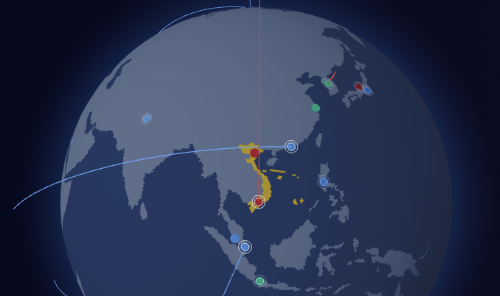
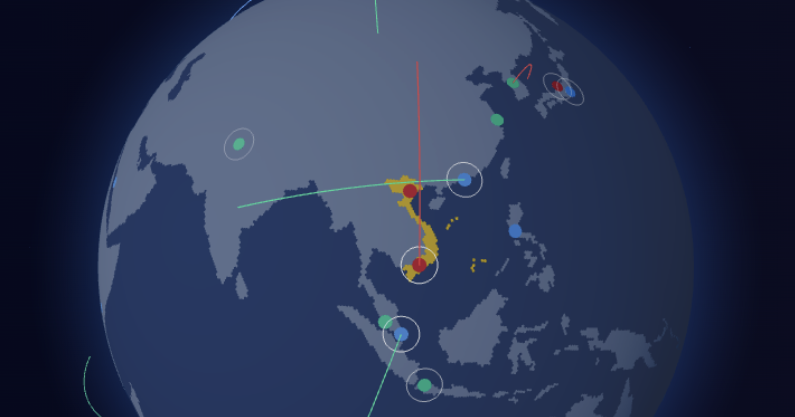

# [ globe.json ]

- `Mẫu GeoJSON` ban đầu lãnh thổ Việt Nam từ nguồn [Download the globe.json](https://assets.aceternity.com/globe.json)

  ```json
  {
    "type": "Feature",
    "properties": {
      "admin": "Vietnam",
      "name": "Vietnam",
      "continent": "Asia"
    },
    "geometry": {
      "type": "Polygon",
      "coordinates": [
        [
          [108.05018029178291, 21.55237986906011],
          [106.71506798709007, 20.696850694252014],
          [105.881682163519, 19.752050482659694],
          [105.66200564984628, 19.058165188060567],
          [106.42681684776599, 18.004120998603224],
          [107.36195356651973, 16.69745656988705],
          [108.2694950704296, 16.079742336486145],
          [108.87710656131745, 15.276690578670436],
          [109.33526981001721, 13.42602834721772],
          [109.20013593957395, 11.66685923913776],
          [108.36612999881542, 11.00832062422627],
          [107.22092858279521, 10.36448395430183],
          [106.4051127462034, 9.530839748569317],
          [105.15826378786508, 8.599759629750492],
          [104.79518517458237, 9.2410383162765],
          [105.07620161338559, 9.918490505406806],
          [104.33433475140345, 10.486543687375228],
          [105.19991499229232, 10.889309800658094],
          [106.24967003786944, 10.961811835163585],
          [105.8105237162531, 11.567614650921225],
          [107.49140302941086, 12.337205918827944],
          [107.6145479675624, 13.535530707244202],
          [107.38272749230106, 14.202440904186968],
          [107.56452518110387, 15.202173163305554],
          [107.31270592654558, 15.908538316303177],
          [106.55600792849566, 16.6042839624648],
          [105.925762160264, 17.485315456608955],
          [105.0945984232815, 18.666974595611073],
          [103.8965320170267, 19.2651809758218],
          [104.18338789267891, 19.624668077060214],
          [104.82257368369707, 19.88664175056388],
          [104.43500044150802, 20.758733221921528],
          [103.20386111858643, 20.766562201413745],
          [102.75489627483464, 21.675137233969462],
          [102.17043582561355, 22.464753119389297],
          [102.70699222210008, 22.708795070887668],
          [103.50451460166055, 22.703756618739202],
          [104.47685835166445, 22.81915009204696],
          [105.3292094258866, 23.35206330005691],
          [105.81124718630521, 22.9768924016179],
          [106.72540327354845, 22.794267889898414],
          [106.5672733907353, 22.218204860924768],
          [107.04342003787261, 21.811898912029907],
          [108.05018029178291, 21.55237986906011]
        ]
      ]
    }
  }
  ```

## Method 1️⃣:

- [Tạo bản đồ Việt Nam gồm 2 quần đảo Trường Sa và Hoàng Sa với react-simple-maps](https://viblo.asia/p/tao-ban-do-viet-nam-gom-2-quan-dao-truong-sa-va-hoang-sa-voi-react-simple-maps-WAyK87wE5xX)
  - [GADM](https://gadm.org/download_country.html)
    - Ở **GADM**, thì dữ liệu trang web này ko bao gồm `Hoàng Sa` và `Trường Sa` ở bản đồ chính `Việt Nam` → _"gadm41_VNM_shp.zip"_.
    - Vì vậy, tiếp tục các bạn tìm thêm:
      - `Paracel Islands (Hoàng Sa)` → _"gadm41_XPI_shp.zip"_
      - `Spratly Islands (Trường Sa)` → _"gadm41_XSP_shp.zip"_
    - Và tải **Shapefile**.
  - [MapShaper](https://mapshaper.org/)
    - Thực hiện **Import** 2 file (.zip) nén vào: _"gadm41_XPI_0"_ ; _"gadm41_XSP_0"_
    - Thực hiện `Simplify` điều chỉnh mức độ chi tiết của bản đồ: giúp đơn giản hóa dữ liệu bản đồ từ **Shapefile** của lãnh thổ Việt Nam, và để sao cho kết quả tương tự như mẫu **GeoJSON Việt Nam** bạn cung cấp (với các tọa độ đã được rút gọn). Bạn cần chọn các thiết lập phù hợp dựa trên đặc điểm của dữ liệu và mục tiêu đơn giản hóa.
      - ✅ **[ Prevent shape removal ]** : Prevent small polygon features from disappearing at high simplification. Keeps the largest ring of multi-ring features.
      - ❌ **[ Use planar geometry ]** : Treat x, y values as Cartesian coordinates on a plane, rather than as longitude, latitude coordinates on a sphere.
      - ❌ **[ Douglas-Peucker ]** : Simplified lines remain within a set distance of original lines. Good for thinning dense points, but spikes tend to form at high simplification.
      - ✅ **[ Visvalingam / effective area ]** : Lines are simplified by iteratively removing the point that forms the least-area triangle with two adjacent points.
      - ❌ **[ Visalingam / weighted area ]** : Points located at the vertex of more acute angles are preferentially removed, for a smoother appearance.
    - Chọn mức `settings = 1%` cho quá trình `Simplify`
    - Cuối cùng thực hiện **Export** ra `file GeoJSON`, nhớ chỉ cần chọn `Layer 0` tương ứng với <u>biên giới quốc gia</u>.
      - Bạn sẽ có 2 file _"gadm41_XPI_0.json"_ (Quần đảo Hoàng Sa) và _"gadm41_XSP_0.json"_ (Quần đảo Trường Sa)

- Dùng AI để bổ sung dữ liệu từ các file trên vào **GeoJSON** gốc của lãnh thổ Việt Nam. Ví dụ, mình dùng `Prompt` như sau...

  ```
  Với 2 file tôi cung cấp, nếu vẫn còn có thể SIMPLIFY, hãy thực hiện, rồi bổ sung dữ liệu đã đơn giản hóa thêm vào JSON gốc.

  Kết quả tạo thành cấu trúc:
  - Đại lục Vietnam (Polygon)
  - Quần đảo Hoàng Sa (MultiPolygon)
  - Quần đảo Trường Sa (MultiPolygon)
  ```

- Quá trình đơn giản hóa:
  - Loại bỏ các tọa độ dư thừa: Giảm từ hàng trăm điểm xuống còn các điểm then chốt cần thiết để duy trì hình dạng cơ bản
  - Làm tròn tọa độ: Từ độ chính xác 14-15 chữ số thập phân xuống 4 chữ số (vẫn đủ chính xác cho việc hiển thị bản đồ)
  - Chỉ giữ lại các đảo lớn nhất:
    - Hoàng Sa: 3 polygon chính thay vì 25 polygon nhỏ
    - Trường Sa: 4 polygon chính thay vì 10+ polygon nhỏ
- JSON mới này bao gồm <u>tổng cộng 8 polygon</u>, thể hiện đầy đủ lãnh thổ Việt Nam bao gồm cả đất liền và các quần đảo trên Biển Đông.

  ```json
  {
    "type": "Feature",
    "properties": {
      "admin": "Vietnam",
      "name": "Vietnam",
      "continent": "Asia"
    },
    "geometry": {
      "type": "Polygon",
      "coordinates": [
        [
          [108.05018029178291, 21.55237986906011],
          [106.71506798709007, 20.696850694252014],
          [105.881682163519, 19.752050482659694],
          [105.66200564984628, 19.058165188060567],
          [106.42681684776599, 18.004120998603224],
          [107.36195356651973, 16.69745656988705],
          [108.2694950704296, 16.079742336486145],
          [108.87710656131745, 15.276690578670436],
          [109.33526981001721, 13.42602834721772],
          [109.20013593957395, 11.66685923913776],
          [108.36612999881542, 11.00832062422627],
          [107.22092858279521, 10.36448395430183],
          [106.4051127462034, 9.530839748569317],
          [105.15826378786508, 8.599759629750492],
          [104.79518517458237, 9.2410383162765],
          [105.07620161338559, 9.918490505406806],
          [104.33433475140345, 10.486543687375228],
          [105.19991499229232, 10.889309800658094],
          [106.24967003786944, 10.961811835163585],
          [105.8105237162531, 11.567614650921225],
          [107.49140302941086, 12.337205918827944],
          [107.6145479675624, 13.535530707244202],
          [107.38272749230106, 14.202440904186968],
          [107.56452518110387, 15.202173163305554],
          [107.31270592654558, 15.908538316303177],
          [106.55600792849566, 16.6042839624648],
          [105.925762160264, 17.485315456608955],
          [105.0945984232815, 18.666974595611073],
          [103.8965320170267, 19.2651809758218],
          [104.18338789267891, 19.624668077060214],
          [104.82257368369707, 19.88664175056388],
          [104.43500044150802, 20.758733221921528],
          [103.20386111858643, 20.766562201413745],
          [102.75489627483464, 21.675137233969462],
          [102.17043582561355, 22.464753119389297],
          [102.70699222210008, 22.708795070887668],
          [103.50451460166055, 22.703756618739202],
          [104.47685835166445, 22.81915009204696],
          [105.3292094258866, 23.35206330005691],
          [105.81124718630521, 22.9768924016179],
          [106.72540327354845, 22.794267889898414],
          [106.5672733907353, 22.218204860924768],
          [107.04342003787261, 21.811898912029907],
          [108.05018029178291, 21.55237986906011]
        ]
      ]
    }
  },
  {
    "type": "Feature",
    "properties": {
      "admin": "Vietnam",
      "name": "Paracel Islands",
      "continent": "Vietnam"
    },
    "geometry": {
      "type": "MultiPolygon",
      "coordinates": [
        [
          [
            [111.2101, 15.79],
            [111.2097, 15.79],
            [111.2094, 15.7903],
            [111.2086, 15.7903],
            [111.2084, 15.7906],
            [111.2081, 15.7906],
            [111.2078, 15.7903],
            [111.2069, 15.7903],
            [111.2069, 15.7902],
            [111.2067, 15.79],
            [111.2061, 15.79],
            [111.2058, 15.7897],
            [111.2053, 15.7897],
            [111.205, 15.79],
            [111.2047, 15.79],
            [111.2044, 15.7897],
            [111.2042, 15.7897],
            [111.2033, 15.7889],
            [111.2031, 15.7889],
            [111.2025, 15.7883],
            [111.2017, 15.7883],
            [111.2014, 15.7881],
            [111.2008, 15.7881],
            [111.2006, 15.7878],
            [111.2003, 15.7878],
            [111.1983, 15.7858],
            [111.1983, 15.7856],
            [111.1978, 15.785],
            [111.1972, 15.785],
            [111.1972, 15.7847],
            [111.1967, 15.7842],
            [111.1967, 15.7839],
            [111.1964, 15.7836],
            [111.1964, 15.7833],
            [111.1961, 15.7831],
            [111.1956, 15.7831],
            [111.1956, 15.7826],
            [111.1956, 15.7825],
            [111.1964, 15.7817],
            [111.1973, 15.7812],
            [111.1975, 15.781],
            [111.1982, 15.7807],
            [111.1987, 15.7804],
            [111.1994, 15.7804],
            [111.2003, 15.7803],
            [111.2014, 15.78],
            [111.2013, 15.7807],
            [111.2013, 15.7811],
            [111.2017, 15.7816],
            [111.2022, 15.7817],
            [111.2027, 15.7815],
            [111.2032, 15.781],
            [111.2032, 15.7804],
            [111.2042, 15.78],
            [111.2056, 15.7803],
            [111.206, 15.7808],
            [111.2065, 15.7809],
            [111.2088, 15.782],
            [111.2092, 15.7831],
            [111.2094, 15.7831],
            [111.21, 15.7836],
            [111.21, 15.7844],
            [111.2103, 15.7847],
            [111.2103, 15.785],
            [111.2108, 15.7856],
            [111.2108, 15.7858],
            [111.2114, 15.7864],
            [111.2114, 15.7867],
            [111.2119, 15.7875],
            [111.2119, 15.7885],
            [111.2112, 15.7892],
            [111.2101, 15.79]
          ]
        ],
        [
          [
            [112.0511, 16.3631],
            [112.0485, 16.3636],
            [112.045, 16.3641],
            [112.0418, 16.3645],
            [112.0378, 16.3649],
            [112.033, 16.3651],
            [112.0282, 16.3649],
            [112.0265, 16.3648],
            [112.0242, 16.3649],
            [112.0205, 16.3638],
            [112.0182, 16.3632],
            [112.016, 16.3629],
            [112.0153, 16.3627],
            [112.0136, 16.3616],
            [112.0129, 16.3612],
            [112.0126, 16.3606],
            [112.0128, 16.3604],
            [112.0137, 16.3604],
            [112.0153, 16.3609],
            [112.0185, 16.3616],
            [112.0213, 16.3621],
            [112.0238, 16.3621],
            [112.0297, 16.3627],
            [112.0318, 16.3632],
            [112.0343, 16.3628],
            [112.0369, 16.363],
            [112.0398, 16.3629],
            [112.043, 16.3627],
            [112.0471, 16.3623],
            [112.0497, 16.3617],
            [112.0512, 16.3614],
            [112.0544, 16.3607],
            [112.0585, 16.3597],
            [112.0621, 16.3584],
            [112.0657, 16.3575],
            [112.069, 16.3567],
            [112.0727, 16.3561],
            [112.0747, 16.3554],
            [112.0773, 16.3549],
            [112.0797, 16.3543],
            [112.0812, 16.3533],
            [112.0832, 16.3523],
            [112.0862, 16.3513],
            [112.0884, 16.3503],
            [112.0894, 16.3502],
            [112.0908, 16.3482],
            [112.0916, 16.3459],
            [112.0923, 16.3439],
            [112.0925, 16.3425],
            [112.0925, 16.3408],
            [112.0919, 16.3389],
            [112.091, 16.3372],
            [112.09, 16.3359],
            [112.0894, 16.3354],
            [112.0887, 16.3351],
            [112.0885, 16.3342],
            [112.0887, 16.3334],
            [112.0896, 16.3337],
            [112.0911, 16.3346],
            [112.0921, 16.3363],
            [112.0931, 16.338],
            [112.0938, 16.3416],
            [112.0944, 16.3442],
            [112.094, 16.3458],
            [112.093, 16.3482],
            [112.0916, 16.3501],
            [112.0906, 16.3513],
            [112.0888, 16.3527],
            [112.0873, 16.3533],
            [112.086, 16.354],
            [112.0834, 16.3549],
            [112.0807, 16.356],
            [112.0789, 16.3567],
            [112.076, 16.3571],
            [112.0728, 16.3579],
            [112.0679, 16.3589],
            [112.0636, 16.36],
            [112.0591, 16.361],
            [112.0551, 16.3621],
            [112.0511, 16.3631]
          ]
        ],
        [
          [
            [112.3083, 16.9661],
            [112.308, 16.9662],
            [112.3078, 16.9664],
            [112.3067, 16.9664],
            [112.3064, 16.9667],
            [112.3056, 16.9667],
            [112.3053, 16.9664],
            [112.3047, 16.9664],
            [112.3045, 16.9662],
            [112.3044, 16.9661],
            [112.3042, 16.9661],
            [112.3039, 16.9658],
            [112.3036, 16.9656],
            [112.3036, 16.965],
            [112.3039, 16.9647],
            [112.3044, 16.9647],
            [112.3047, 16.9644],
            [112.305, 16.9644],
            [112.3053, 16.9642],
            [112.3058, 16.9642],
            [112.3061, 16.9639],
            [112.3067, 16.9639],
            [112.3069, 16.9636],
            [112.3072, 16.9636],
            [112.3075, 16.9633],
            [112.3078, 16.9633],
            [112.3081, 16.9631],
            [112.3083, 16.9631],
            [112.3089, 16.9625],
            [112.3094, 16.9625],
            [112.3097, 16.9622],
            [112.31, 16.9622],
            [112.3103, 16.9619],
            [112.3108, 16.9619],
            [112.3111, 16.9617],
            [112.3114, 16.9617],
            [112.3117, 16.9614],
            [112.3122, 16.9614],
            [112.3125, 16.9611],
            [112.3128, 16.9611],
            [112.3131, 16.9608],
            [112.3133, 16.9608],
            [112.3136, 16.9606],
            [112.3144, 16.9606],
            [112.3147, 16.9603],
            [112.315, 16.9603],
            [112.3153, 16.96],
            [112.3156, 16.96],
            [112.3161, 16.9606],
            [112.3158, 16.9608],
            [112.3158, 16.9614],
            [112.3156, 16.9617],
            [112.315, 16.9617],
            [112.3136, 16.9631],
            [112.3133, 16.9631],
            [112.3125, 16.9639],
            [112.3122, 16.9639],
            [112.3117, 16.9644],
            [112.3114, 16.9644],
            [112.3111, 16.9647],
            [112.3108, 16.9647],
            [112.3106, 16.965],
            [112.3103, 16.965],
            [112.31, 16.9653],
            [112.3097, 16.9653],
            [112.3094, 16.9656],
            [112.3092, 16.9656],
            [112.3089, 16.9658],
            [112.3086, 16.9658],
            [112.3083, 16.9661]
          ]
        ]
      ]
    }
  },
  {
    "type": "Feature",
    "properties": {
      "admin": "Vietnam",
      "name": "Spratly Islands",
      "continent": "Vietnam"
    },
    "geometry": {
      "type": "MultiPolygon",
      "coordinates": [
        [
          [
            [114.4786, 10.3753],
            [114.4803, 10.3736],
            [114.4806, 10.3736],
            [114.4808, 10.3733],
            [114.4811, 10.3736],
            [114.4814, 10.3736],
            [114.4817, 10.3739],
            [114.4817, 10.3747],
            [114.4806, 10.3758],
            [114.4806, 10.3761],
            [114.48, 10.3767],
            [114.4794, 10.3768],
            [114.4789, 10.3767],
            [114.4786, 10.3764],
            [114.4786, 10.3753]
          ]
        ],
        [
          [
            [114.4228, 10.6683],
            [114.4225, 10.6681],
            [114.4225, 10.6675],
            [114.4236, 10.6664],
            [114.4247, 10.6664],
            [114.425, 10.6667],
            [114.4253, 10.6667],
            [114.4253, 10.6669],
            [114.4256, 10.6672],
            [114.4253, 10.6675],
            [114.4253, 10.6678],
            [114.425, 10.6681],
            [114.425, 10.6683],
            [114.4247, 10.6686],
            [114.4247, 10.6689],
            [114.4239, 10.6697],
            [114.4236, 10.6697],
            [114.4228, 10.6689],
            [114.4228, 10.6683]
          ]
        ],
        [
          [
            [115.8025, 10.7311],
            [115.803, 10.7306],
            [115.8033, 10.7302],
            [115.8041, 10.7301],
            [115.8043, 10.7307],
            [115.8043, 10.7313],
            [115.8042, 10.7319],
            [115.8042, 10.7322],
            [115.8044, 10.7325],
            [115.8044, 10.7331],
            [115.8033, 10.7342],
            [115.8028, 10.7342],
            [115.8022, 10.7336],
            [115.8022, 10.7331],
            [115.8019, 10.7328],
            [115.8019, 10.7317],
            [115.8025, 10.7311]
          ]
        ],
        [
          [
            [115.8217, 10.8167],
            [115.8215, 10.8165],
            [115.8214, 10.8158],
            [115.8216, 10.8156],
            [115.8222, 10.8156],
            [115.8231, 10.8164],
            [115.823, 10.8167],
            [115.8228, 10.817],
            [115.8227, 10.8172],
            [115.8223, 10.8173],
            [115.8219, 10.8172],
            [115.8217, 10.8167]
          ]
        ]
      ]
    }
  }
  ```

- Tuy nhiên, vì kích thước các quần đảo quá nhỏ so với kích thước đại lục 😅. Và để hiển thị thấy được trên **Globe** có độ phân giải tương tối (vì cần ưu tiên tính hiệu suất khi render). Nên mình đã thực hiện **SCALE** lãnh thổ các quần đảo lên nhiều lần 🤣.
  - Đầu tiên, mình cần cung cấp data JSON (đã có) của từng nhóm quần đảo vào file _"scale-geometry.js"_.
  - Tiếp theo là chọn hệ số phóng to `(SCALE_FACTOR)`, mình đã chọn:
    - `x100` cho _"Paracel Islands (Hoàng Sa)"_
    - `x300` cho _"Spratly Islands (Trường Sa)"_
  - Sau đó chạy `file (.js)` với lệnh `node scale-geometry.js` để lấy data.
  - Cuối cùng thêm các data GeoJSON đã _"scale"_ trên vào kế bên GeoJSON của _"Đại lục Vietnam"_ trong file `globe.json`.

- Kết quả 😇:
  

## Method 2️⃣:

- Dựa theo cảm hứng từ video [Github Globe Clone using Three.js | Three.js Portfolio Website](https://www.youtube.com/watch?v=ddIZlWmfFKM) ➡️ tôi tìm đến trang [GeoJson map of the Globe](https://geojson-maps.kyd.au/).
  - Trang này cung cấp cho tôi _"GeoJSON countries Vector maps"_.
  - Để có dữ liệu `JSON` của 2 nhóm quần đảo gồm:
    - `Paracel Islands (Hoàng Sa)` → thường có mã viết tắt `XPI`
    - `Spratly Islands (Trường Sa)` → thường có mã viết tắt `XSP`
  - Tôi chọn cấu hình:
    - `Resolution` _(How detailed does your map need to be?)_ ➡️ `High resolution` _(10 metre, largest file)_
    - `Regions` _(Choose from some preset regions)_
  - Phải chọn <u>độ phân giải cao</u>, để có được data tọa độ của 2 nhóm quần đảo này.

- Còn đây là bộ khung `JSON` sẵn cho lãnh thổ **Việt Nam**, gồm <u>3 nhóm</u> để thêm vào file `globe.json`:
  - Nhóm `(1)` lãnh thổ **VietNam** trong đất liền:
    ```json
    {
      "type": "Feature",
      "properties": {
        "admin": "Vietnam",
        "name": "Vietnam",
        "continent": "Asia"
      },
      "geometry": {
        "type": "Polygon",
        "coordinates": [
          [
            [..., ...],
          ]
        ]
      }
    }
    ```
  - Nhóm `(2)` lãnh thổ quần đảo **Paracel**:
    ```json
    {
      "type": "Feature",
      "properties": {
        "admin": "Vietnam",
        "name": "Paracel Islands",
        "continent": "Asia"
      },
      "geometry": {
        "type": "MultiPolygon",
        "coordinates": [
          [
            [..., ...],
          ]
        ]
      }
    }
    ```
  - Nhóm `(3)` lãnh thổ quần đảo **Spratly**:
    ```json
    {
      "type": "Feature",
      "properties": {
        "admin": "Vietnam",
        "name": "Spratly Islands",
        "continent": "Asia"
      },
      "geometry": {
        "type": "MultiPolygon",
        "coordinates": [
          [
            [..., ...],
          ]
        ]
      }
    }
    ```

- Trong đó dữ liệu _nhóm (1)_ đã có sẵn trước, tôi cần thêm dữ liệu _nhóm (2) và (3)_.
  - Theo thông tin từ Chat-GPT 🤖:
    - 🌍 Cấu trúc chuẩn của **GeoJSON**:
      - Theo đặc tả chính thức **RFC 7946**, mọi tọa độ trong **GeoJSON** đều theo thứ tự: `[Kinh độ, Vĩ độ] = [longitude, latitude]`
    - 🧭 `Paracel Islands (Hoàng Sa)` là gì?
      - Tên quốc tế: Paracel Islands
      - Tên Việt Nam: Quần đảo Hoàng Sa
      - Tọa độ trung tâm: khoảng `16.5° N, 112.3° E`
      - Phạm vi tọa độ (khoảng): 👉 `[111.5, 15.5] → [113.0, 17.5]`
      - Thuộc Biển Đông, cách Đà Nẵng khoảng 350 km.
      - Là vùng được Việt Nam tuyên bố chủ quyền, hiện do Trung Quốc kiểm soát (quản lý bởi “Sansha City”).
    - 🧭 `Spratly Islands (Trường Sa)` là gì?
      - Tên quốc tế: Spratly Islands
      - Tên Việt Nam: Quần đảo Trường Sa
      - Tọa độ trung tâm: khoảng `8.6° N, 112.0° E`
      - Phạm vi tọa độ (khoảng): 👉 `[109.5, 7.0] → [117.0, 12.0]`
      - Thuộc Biển Đông, cách Cam Ranh (Khánh Hòa) khoảng 500 km về phía Đông Nam.
      - Là vùng được Việt Nam tuyên bố chủ quyền, hiện có nhiều quốc gia cùng tuyên bố và kiểm soát một phần, bao gồm Việt Nam, Trung Quốc, Philippines, Malaysia và Đài Loan.
      - Việt Nam đang quản lý hành chính vùng này thông qua huyện Trường Sa, tỉnh Khánh Hòa.

- Khi trích data từ _"GeoJson map of the Globe"_, với _"quần đảo Trường Sa"_ thì dễ, tôi có thể lấy trực tiếp từ tên gọi quốc tế `Spratly Islands`:

  ```json
  {
    "type": "Feature",
    "properties": {
      "admin": "Vietnam",
      "name": "Spratly Islands",
      "continent": "Asia"
    },
    "geometry": {
      "type": "MultiPolygon",
      "coordinates": [
        [
          [
            [115.36719811300009, 10.237494208000044],
            [115.36597741000003, 10.239162502000056],
            [115.36793053500003, 10.239162502000056],
            [115.36719811300009, 10.237494208000044]
          ]
        ],
        [
          [
            [114.37322024800005, 9.687648830000057],
            [114.37468509200005, 9.68976471600007],
            [114.37867272200003, 9.692694403000075],
            [114.38103274800005, 9.692206122000073],
            [114.38184655000009, 9.69017161700009],
            [114.38184655000009, 9.689642645000049],
            [114.38086998800009, 9.686224677000041],
            [114.37647545700008, 9.680121161000045],
            [114.373383009, 9.679510809000078],
            [114.37061608200008, 9.681382554000038],
            [114.37086022200003, 9.684149481000077],
            [114.37322024800005, 9.687648830000057]
          ]
        ],
        [
          [
            [114.029633009, 10.011867580000057],
            [114.027679884, 10.015122789000088],
            [114.02930748800009, 10.017401434000078],
            [114.03777103000004, 10.021063544000071],
            [114.04004967500009, 10.019476630000042],
            [114.03394616000003, 10.012396552000041],
            [114.029633009, 10.011867580000057]
          ]
        ],
        [
          [
            [114.36540774800005, 10.175482489000046],
            [114.36036217500009, 10.176255601000037],
            [114.35865319100003, 10.179348049000055],
            [114.35889733200008, 10.183417059000078],
            [114.36304772200003, 10.187079169000071],
            [114.36597741000003, 10.187201239000046],
            [114.36980228000004, 10.18390534100007],
            [114.37126712300005, 10.180487372000073],
            [114.36540774800005, 10.175482489000046]
          ]
        ],
        [
          [
            [114.46420332100001, 10.367377020000049],
            [114.46168053500003, 10.372015692000048],
            [114.46461022200003, 10.37799713700008],
            [114.46697024800005, 10.37836334800005],
            [114.46973717500009, 10.376654364000046],
            [114.47095787900003, 10.372300523000092],
            [114.46843509200005, 10.367743231000077],
            [114.46420332100001, 10.367377020000049]
          ]
        ],
        [
          [
            [114.36378014400009, 10.367865302000041],
            [114.35889733200008, 10.372544664000088],
            [114.35816491000003, 10.377427476000037],
            [114.36036217500009, 10.378566799000055],
            [114.36638431100005, 10.37400950700004],
            [114.36784915500004, 10.370835679000038],
            [114.36695397200003, 10.368068752000056],
            [114.36378014400009, 10.367865302000041]
          ]
        ],
        [
          [
            [114.45484459700003, 10.388332424000055],
            [114.45020592500009, 10.389797268000052],
            [114.44996178500003, 10.39443594000005],
            [114.45191491000003, 10.396633205000057],
            [114.45492597700002, 10.39720286700009],
            [114.45834394600001, 10.395819403000075],
            [114.45980879000001, 10.392726955000057],
            [114.45484459700003, 10.388332424000055]
          ]
        ],
        [
          [
            [115.83057701900009, 10.73460521000004],
            [115.83139082100001, 10.734198309000078],
            [115.83399498800009, 10.729437567000048],
            [115.83269290500004, 10.727728583000044],
            [115.830414259, 10.727443752000056],
            [115.82496178500003, 10.726752020000049],
            [115.81836998800009, 10.720851955000057],
            [115.81462649800005, 10.723334052000041],
            [115.812836134, 10.727687893000052],
            [115.81462649800005, 10.734320380000042],
            [115.81788170700008, 10.73509349200009],
            [115.82813561300009, 10.735988674000055],
            [115.83057701900009, 10.73460521000004]
          ]
        ],
        [
          [
            [115.84034264400009, 10.823187567000048],
            [115.83375084700003, 10.824042059000078],
            [115.83025149800005, 10.827704169000071],
            [115.82960045700008, 10.831773179000038],
            [115.83122806100005, 10.83344147300005],
            [115.84148196700005, 10.832709052000041],
            [115.84473717500009, 10.831284898000092],
            [115.84522545700008, 10.831203518000052],
            [115.84880618600005, 10.82640208500004],
            [115.84693444100003, 10.823391018000052],
            [115.84571373800009, 10.822414455000057],
            [115.84034264400009, 10.823187567000048]
          ]
        ],
        [
          [
            [114.27857506600003, 11.040432033000059],
            [114.27165774800005, 11.043524481000077],
            [114.27222741000003, 11.045843817000048],
            [114.27857506600003, 11.050034898000092],
            [114.28272545700008, 11.05068594000005],
            [114.28687584700003, 11.046616929000038],
            [114.28305097700002, 11.04100169500009],
            [114.27857506600003, 11.040432033000059]
          ]
        ],
        [
          [
            [115.01840254000001, 11.107123114000046],
            [115.01384524800005, 11.10765208500004],
            [115.00912519600001, 11.113226630000042],
            [115.010101759, 11.115912177000041],
            [115.01238040500004, 11.115301825000074],
            [115.02076256600003, 11.117987372000073],
            [115.02165774800005, 11.114569403000075],
            [115.02035566500001, 11.10927969000005],
            [115.01840254000001, 11.107123114000046]
          ]
        ],
        [
          [
            [114.36133873800009, 9.76711660400008],
            [114.35995527400007, 9.770046291000085],
            [114.36280358200008, 9.769110419000071],
            [114.36133873800009, 9.76711660400008]
          ]
        ]
      ]
    }
  }
  ```

- Riêng với _"quần đảo Hoàng Sa"_ thì phiền phức hơn, khi không thể tìm thấy với tên gọi quốc tế là `Paracel Islands`, mà lại được liệt kê chung trong nhóm của `China` _(People's Republic of China)_ ⁉️. Tôi trích xuất ra từng mảng đảm bảo vẫn thuộc trong phạm vi tọa độ quốc tế và được kết quả như sau:

  ```json
  {
    "type": "Feature",
    "properties": {
      "admin": "Vietnam",
      "name": "Paracel Islands",
      "continent": "Asia"
    },
    "geometry": {
      "type": "MultiPolygon",
      "coordinates": [
        [
          [
            [111.19654381600003, 15.77537669500009],
            [111.19410241000003, 15.77610911700009],
            [111.19288170700003, 15.778225002000056],
            [111.19629967500003, 15.785711981000077],
            [111.19939212300005, 15.789211330000057],
            [111.20753014400003, 15.78929271000004],
            [111.20850670700003, 15.786281643000052],
            [111.20753014400003, 15.782171942000048],
            [111.20460045700003, 15.779242255000042],
            [111.19654381600003, 15.77537669500009]
          ]
        ],
        [
          [
            [111.76335696700005, 16.043443101000037],
            [111.75310306100005, 16.044663804000038],
            [111.75342858200003, 16.047430731000077],
            [111.76140384200005, 16.048651434000078],
            [111.76587975400003, 16.045314846000053],
            [111.76335696700005, 16.043443101000037]
          ]
        ],

        [
          [
            [111.60010826900003, 16.527289130000042],
            [111.59986412900003, 16.527492580000057],
            [111.60084069100003, 16.53196849200009],
            [111.60287519600007, 16.533351955000057],
            [111.60572350400003, 16.53351471600007],
            [111.60816491000003, 16.531805731000077],
            [111.60962975400003, 16.528265692000048],
            [111.60889733200003, 16.52724844000005],
            [111.60629316500007, 16.524237372000073],
            [111.60279381600003, 16.524644273000092],
            [111.60010826900003, 16.527289130000042]
          ]
        ],
        [
          [
            [112.73503665500004, 16.657945054000038],
            [112.73015384200005, 16.660223700000074],
            [112.72527103000004, 16.66620514500005],
            [112.72624759200005, 16.66901276200008],
            [112.72877037900003, 16.669256903000075],
            [112.73340905000009, 16.666083075000074],
            [112.73682701900009, 16.660223700000074],
            [112.73503665500004, 16.657945054000038]
          ]
        ],
        [
          [
            [112.33318118600005, 16.825018622000073],
            [112.32715905000009, 16.829738674000055],
            [112.32593834700003, 16.833238023000092],
            [112.32789147200003, 16.837103583000044],
            [112.33057701900009, 16.837632554000038],
            [112.33545983200008, 16.832586981000077],
            [112.33725019600001, 16.82843659100007],
            [112.33318118600005, 16.825018622000073]
          ]
        ],
        [
          [
            [112.33366946700005, 16.933254299000055],
            [112.33668053500003, 16.932114976000037],
            [112.33708743600005, 16.932033596000053],
            [112.33757571700005, 16.931341864000046],
            [112.34107506600003, 16.926988023000092],
            [112.34050540500004, 16.923570054000038],
            [112.33545983200008, 16.92381419500009],
            [112.33366946700005, 16.92641836100006],
            [112.33366946700005, 16.933254299000055]
          ]
        ],

        [
          [
            [111.68026777400007, 16.578151760000083],
            [111.67888431100005, 16.58112213700008],
            [111.68165123800003, 16.580186265000066],
            [111.68026777400007, 16.578151760000083]
          ]
        ]
      ]
    }
  }
  ```

- Sau khi có data của 2 quần đảo trên. Lưu ý ‼️:
  - Data trích xuất này chỉ mang tính chất tương đối thôi 😅
  - Lúc này data vẫn thuộc dạng có _"độ phân giải cao"_, khoảng `10 metre`.
  - Trong khi data dùng cho **[Globe Three.js]** thuộc dạng _"độ phân giải thấp"_, khoảng `40.000 metre`.

- Để hiển thị được các quần đảo lên **Globe**, mình cần _"scale"_ chúng lên tầm khoảng `x40 lần`.
  - ⚠️ Ở script cũ `(scale-geometry.js)` ➡️ thủ thuật scale là `scale tuyến tính` trong _"mặt phẳng Cartesian (x-y)"_. Nên chỉ đúng khi dữ liệu nằm trong **Hệ tọa độ phẳng (projected coordinates)**.
  - ❌ Nhưng vì **GeoJSON** dùng _"kinh độ–vĩ độ (longitude–latitude)"_ trên **Hình cầu Trái Đất**, nên phép nhân tọa độ không phản ánh đúng “phóng to” trên bề mặt cầu.
  - ✅ Để _“scale chính xác theo tọa độ địa lý (vĩ độ, kinh độ trên cầu)”_, ta cần làm `scale theo góc` — tức là tính toán theo bán kính góc (angular distance) giữa các điểm và tâm.
  - 💎 Vậy nên lần này mình chạy script mới `(scale-geometry-upgrade.js)`.
    - Sử dụng dữ liệu input _"độ phân giải cao (10metre)"_ có chọn lọc.
    - Chọn hệ số scale `x40 lần`.

- Và đây là kết quả 🥰:
  
